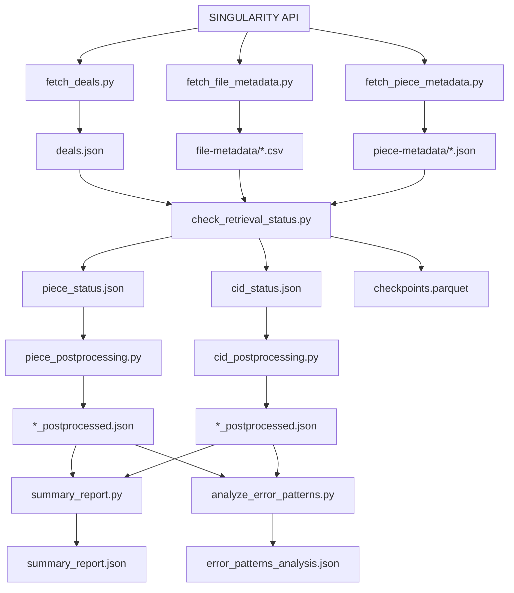
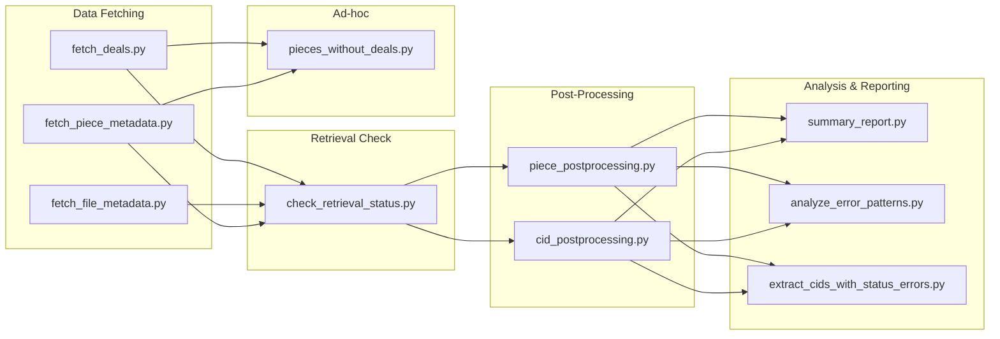

# Scripts Overview

> **Filecoin Unsealed Retrieval Check Analysis** — A comprehensive toolkit for fetching deal metadata, checking retrieval status, and analyzing error patterns across storage providers.

## Table of Contents

- [Quick Start](#quick-start)
- [Configuration System](#configuration-system)
- [Scripts Reference](#scripts-reference)
  - [Data Fetching](#data-fetching)
  - [Retrieval Checking](#retrieval-checking)
  - [Post-Processing](#post-processing)
  - [Analysis & Reporting](#analysis--reporting)
- [Summary Report Package](#summary-report-package)
- [Output Directory Structure](#output-directory-structure)
- [Workflow Diagrams](#workflow-diagrams)

---

## Quick Start

### Typical Workflow

Run scripts in this order for a complete analysis:

```bash
# 1. Fetch data from Singularity API
python scripts/fetch_deals.py
python scripts/fetch_file_metadata.py
python scripts/fetch_piece_metadata.py

# 2. Run retrieval checks against storage providers
python scripts/check_retrieval_status.py

# 3. Enrich retrieval data with deal information
python scripts/check_retrieval_status_piece_postprocessing.py
python scripts/check_retrieval_status_cid_postprocessing.py

# 4. Generate reports
python scripts/summary_report.py

# 5. Optional: Deep-dive analysis
python scripts/analyze_error_patterns.py
python scripts/extract_cids_with_status_errors.py
python scripts/pieces_without_deals.py --storage-provider f02639429
```

### Prerequisites

- Python 3.10+
- Dependencies: `pip install -r requirements.txt` (or see `pyproject.toml`)
- A running Singularity API instance
- Valid `config.json` in project root (copy from `config.example.json`)

---

## Configuration System

All scripts use a centralized configuration system defined in `scripts/config.py`.

### Config File Location

- Default: `config.json` in project root
- Override with `--config <path>` on most scripts

### Config Structure

```json
{
  "singularity_api": {
    "base_url": "http://212.6.53.5:9090"
  },
  "storage_providers": {
    "f02639429": {
      "name": "Milad",
      "retrieval_endpoint": "https://f02639429.infrafolio.com"
    },
    "f03493414": {
      "name": "Dcent",
      "retrieval_endpoint": "http://212.6.53.56"
    }
  },
  "paths": {
    "output_dir": "./output",
    "deals_file": "./output/deals.json",
    "file_metadata_dir": "./output/file-metadata",
    "piece_metadata_dir": "./output/piece-metadata",
    "retrieval_status_dir": "./output/retrieval-status",
    "error_analysis_dir": "./output/error-analysis",
    "logs_dir": "./output/logs",
    "summary_reports_dir": "./output/summary-reports"
  },
  "retrieval_defaults": {
    "batch_size": 100,
    "concurrency": 10,
    "request_timeout": 30
  },
  "fetch_defaults": {
    "concurrency": 20
  }
}
```

### Key Functions

| Function | Purpose | Example |
|----------|---------|---------|
| `load_config()` | Load and merge config with defaults | `config = load_config()` |
| `get_storage_providers(config)` | Get provider ID → config mapping | `providers = get_storage_providers(config)` |
| `get_api_endpoint(config)` | Get Singularity API base URL | `url = get_api_endpoint(config)` |
| `get_path(config, key)` | Get directory path | `get_path(config, "output_dir")` |
| `get_file_path(config, key)` | Get full file path (dir + filename) | `get_file_path(config, "deals_filename")` |

### Deep Merge Behavior

Config values are **merged on top of defaults** (additive, not replacing). This means:

- Storage providers in `config.json` are **added to** any default providers
- Missing keys fall back to `DEFAULT_CONFIG` values

---

## Scripts Reference

### Data Fetching

#### `fetch_deals.py`

Fetches deal information from the Singularity API.

| Property | Value |
|----------|-------|
| **Input** | Singularity API `/api/deal` endpoint |
| **Output** | `output/deals.json` |
| **Dependencies** | None (runs first) |

**Usage:**

```bash
# Use config defaults
python scripts/fetch_deals.py

# Override API endpoint
python scripts/fetch_deals.py --base-url http://example.com:9090

# Override output path
python scripts/fetch_deals.py --output ./my_deals.json

# Use custom config file
python scripts/fetch_deals.py --config ./my_config.json
```

**CLI Options:**

| Flag | Description | Default |
|------|-------------|---------|
| `--base-url` | Singularity API base URL | From config |
| `--output`, `-o` | Output file path | `output/deals.json` |
| `--config` | Path to config file | `config.json` |

---

#### `fetch_file_metadata.py`

Fetches file-level metadata from the Singularity API for each preparation.

| Property | Value |
|----------|-------|
| **Input** | Singularity API `/api/preparation/{id}/piece` endpoints |
| **Output** | `output/file-metadata/{dataset}_prep{id}_details.csv` (one per preparation) |
| **Dependencies** | None |

**Usage:**

```bash
# Fetch all preparations
python scripts/fetch_file_metadata.py

# Fetch specific preparations
python scripts/fetch_file_metadata.py --prep-ids 1 2 3

# Override API endpoint
python scripts/fetch_file_metadata.py --endpoint "http://212.6.53.5:9090"
```

**CLI Options:**

| Flag | Description | Default |
|------|-------------|---------|
| `--endpoint` | Singularity API base URL | From config |
| `--prep-ids` | Specific preparation IDs to fetch | All |
| `--output` | Output directory | `output/file-metadata/` |

**Output Filename Pattern:** `{dataset_name}_prep{id}_details.csv`

---

#### `fetch_piece_metadata.py`

Fetches piece-level metadata from the Singularity API.

| Property | Value |
|----------|-------|
| **Input** | Singularity API `/api/preparation/{id}/piece` endpoint |
| **Output** | `output/piece-metadata/{dataset}_prep{id}_details.json` (one per preparation) |
| **Dependencies** | None |

**Usage:**

```bash
# Fetch all preparations
python scripts/fetch_piece_metadata.py

# Fetch specific preparations
python scripts/fetch_piece_metadata.py --prep-ids 1 2 3

# Override API endpoint
python scripts/fetch_piece_metadata.py --endpoint "http://212.6.53.5:9090"
```

**CLI Options:**

| Flag | Description | Default |
|------|-------------|---------|
| `--endpoint` | Singularity API base URL | From config |
| `--prep-ids` | Specific preparation IDs to fetch | All |
| `--output` | Output directory | `output/piece-metadata/` |

**Output Filename Pattern:** `{dataset_name}_prep{id}_details.json`

---

### Retrieval Checking

#### `check_retrieval_status.py`

Main retrieval checking script. Tests piece-level and CID-level retrievability against configured storage providers.

| Property | Value |
|----------|-------|
| **Input** | `output/deals.json`, `output/piece-metadata/*.json` |
| **Output** | `final_retrieval_piece_status.json`, `final_retrieval_cid_status.json` (in `retrieval-status/`) |
| **Dependencies** | `fetch_deals.py`, `fetch_piece_metadata.py` |
| **Logs** | `output/logs/retrieval_status.log` |

**Features:**

- **Checkpoint-based resume** — Uses parquet files to resume interrupted runs
- **Deals-aware processing** — Only checks providers with active deals
- **Configurable concurrency** — Batch size, concurrency, and timeout settings
- **Progress bars** — Visual progress for large datasets

**Usage:**

```bash
# Use config defaults
python scripts/check_retrieval_status.py

# Check specific preparations
python scripts/check_retrieval_status.py --prep-ids 1 2 3

# Use custom config
python scripts/check_retrieval_status.py --config ./my_config.json
```

**CLI Options:**

| Flag | Description | Default |
|------|-------------|---------|
| `--prep-ids` | Specific preparation IDs to check | All |
| `--config` | Path to config file | `config.json` |

**Special Status Codes:**

- `-1` — No active deal with provider (not an error, just skipped)

---

### Post-Processing

#### `check_retrieval_status_piece_postprocessing.py`

Enriches piece retrieval status with preparation IDs and active deal information.

| Property | Value |
|----------|-------|
| **Input** | Piece status JSON, deals JSON, piece metadata JSONs |
| **Output** | `output/retrieval-status/final_retrieval_piece_status_postprocessed.json` |
| **Dependencies** | `check_retrieval_status.py`, `fetch_deals.py`, `fetch_piece_metadata.py` |

**Enrichments Added:**

- `preparation` — Preparation ID from piece metadata
- `filesize_predeal` — Original file size before deal
- `active_deal_providers` — List of provider IDs with active deals
- `storage_provider_retrieval_check` — Per-provider check results with deal state

**Usage:**

```bash
# Use config defaults
python scripts/check_retrieval_status_piece_postprocessing.py

# Override specific paths
python scripts/check_retrieval_status_piece_postprocessing.py \
  --piece-status-file ./custom_piece_status.json \
  --deals-file ./custom_deals.json \
  --output-file ./enriched_output.json
```

---

#### `check_retrieval_status_cid_postprocessing.py`

Enriches CID retrieval status with file metadata and active deal information.

| Property | Value |
|----------|-------|
| **Input** | CID status JSON, deals JSON, file metadata CSVs |
| **Output** | `output/retrieval-status/final_retrieval_cid_status_postprocessed.json` |
| **Dependencies** | `check_retrieval_status.py`, `fetch_deals.py`, `fetch_file_metadata.py` |

**Enrichments Added:**

- `file_name` — Original filename from file metadata
- `file_type` — File extension/type
- `file_size` — File size in bytes
- `active_deal_providers` — List of provider IDs with active deals
- `has_active_deal` — Boolean flag
- `storage_provider_retrieval_check` — Per-provider check results with deal state/ID

**Usage:**

```bash
# Use config defaults
python scripts/check_retrieval_status_cid_postprocessing.py

# Override specific paths
python scripts/check_retrieval_status_cid_postprocessing.py \
  --cid-status-file ./custom_cid_status.json \
  --deals-file ./custom_deals.json \
  --file-metadata-dir ./custom_metadata/ \
  --output-file ./enriched_output.json
```

---

### Analysis & Reporting

#### `summary_report.py`

Main summary report generator. Computes comprehensive metrics from all retrieval data.

| Property | Value |
|----------|-------|
| **Input** | All postprocessed status files, deals, file/piece metadata |
| **Output** | `output/summary-reports/summary_report.json` |
| **Dependencies** | All post-processing scripts completed |

**Metrics Computed:**

- Overall retrieval success rates
- Per-preparation breakdowns
- Per-storage-provider breakdowns
- Prepared content metrics (from source metadata)
- Error analysis (HTTP 500 patterns)
- File type and size distributions

**Edge Case Handling:**

- Zero retrieval checks → `success_rate` returns `null` (not `0.0`)
- Empty preparations → Included with zeroed statistics
- See `docs/spec/retrieval-check-summary.v1/03-metric-calculations.md` for full details

**Output Structure:**

```json
{
  "metadata": { "generated_at": "...", "input_files": {...} },
  "overall_retrieval": { "counts": {...}, "piece_outcomes": {...}, "cid_outcomes": {...} },
  "by_preparation": { "<prep_id>": {...} },
  "by_storage_provider": { "<provider_id>": {...} },
  "prepared_content": { "overall": {...}, "by_preparation": {...} },
  "error_analysis": { "overview": {...}, "by_provider": {...}, "cross_provider_analysis": {...} }
}
```

**Usage:**

```bash
# Generate summary report
python scripts/summary_report.py
```

---

#### `analyze_error_patterns.py`

Deep-dive analysis of error patterns from retrieval failures.

| Property | Value |
|----------|-------|
| **Input** | `output/retrieval-status/final_retrieval_cid_status_postprocessed.json` |
| **Output** | `output/error-analysis/error_patterns_analysis.json` |
| **Dependencies** | `check_retrieval_status_cid_postprocessing.py` |

**Features:**

- **Provider-agnostic** — Works with any providers found in data
- **Unknown provider detection** — Reports providers not in config
- **Cross-provider analysis**:
  - `all_fail` — Every active provider returned HTTP 500
  - `some_fail` — At least one failed, at least one succeeded
- **Sample CID lists** — Up to 100 samples per category for debugging

**Error Categories (in detection order):**

- `multihash_not_found`
- `root_load_failure`
- `piece_not_found`
- `cid_not_found`
- `timeout`
- `connection_error`
- `ipld_error`
- `node_not_found`
- `other`

> **Note:** Categories are checked in order; first match wins. See `03-metric-calculations.md` for detection logic.

**Usage:**

```bash
# Full analysis with file output
python scripts/analyze_error_patterns.py

# Filter to single provider
python scripts/analyze_error_patterns.py --provider f02639429

# Print summary only (no file output)
python scripts/analyze_error_patterns.py --summary-only

# Custom input file
python scripts/analyze_error_patterns.py --input ./custom_cid_status.json
```

**CLI Options:**

| Flag | Description | Default |
|------|-------------|---------|
| `--input` | Input JSON file path | From config |
| `--provider` | Filter to single provider ID | All providers |
| `--summary-only` | Print analysis without saving | Save to file |

---

#### `extract_cids_with_status_errors.py`

Extracts CIDs that have retrieval errors for targeted investigation.

| Property | Value |
|----------|-------|
| **Input** | `output/retrieval-status/final_retrieval_cid_status_postprocessed.json` |
| **Output** | `output/error-analysis/cid_status_errors.json`<br>`output/error-analysis/cid_all_providers_failed.json`<br>`output/error-analysis/cid_errors_summary.json` |
| **Dependencies** | `check_retrieval_status_cid_postprocessing.py` |
| **Logs** | `output/logs/extract_cids_with_status_errors.log` |

**Usage:**

```bash
# Use defaults (active deals only)
python scripts/extract_cids_with_status_errors.py

# Summary only (no file output)
python scripts/extract_cids_with_status_errors.py --summary-only

# Include non-active deals in analysis
python scripts/extract_cids_with_status_errors.py --include-non-active

# Custom input/output
python scripts/extract_cids_with_status_errors.py \
  --input cid_sample.json \
  --output my_errors.json
```

**CLI Options:**

| Flag | Description | Default |
|------|-------------|---------|
| `--input` | Input JSON file path | From config |
| `--output` | Output JSON file path | From config |
| `--summary-only` | Print summary without saving | Save to file |
| `--include-non-active` | Include all providers, not just active deals | Active only |

---

#### `pieces_without_deals.py`

Reports pieces that lack active deals with a specific storage provider.

| Property | Value |
|----------|-------|
| **Input** | `output/deals.json`<br>`output/piece-metadata/*.json` |
| **Output** | `output/pieces_without_deals_{provider_id}.json` |
| **Dependencies** | `fetch_deals.py`, `fetch_piece_metadata.py` |

**Features:**

- **Provider validation** — Errors if provider not found in deals, shows valid options
- **Dynamic output filename** — Includes provider ID
- **Preparation filtering** — Limit to specific preparations
- **List-only mode** — Simplified output with just pieceCid arrays

**Usage:**

```bash
# Required: specify storage provider
python scripts/pieces_without_deals.py --storage-provider f02639429

# Filter to specific preparations
python scripts/pieces_without_deals.py --storage-provider f02639429 --preparation 1 2 3

# Simplified output (just CID arrays)
python scripts/pieces_without_deals.py --storage-provider f02639429 --list-only

# Override paths
python scripts/pieces_without_deals.py \
  --storage-provider f02639429 \
  --deals ./custom_deals.json \
  --piece-metadata ./custom_metadata/ \
  --output ./custom_output.json
```

**CLI Options:**

| Flag | Description | Default |
|------|-------------|---------|
| `--storage-provider` | Provider ID to check (required) | — |
| `--preparation` | Filter to specific prep IDs | All |
| `--list-only` | Output only pieceCid arrays | Full details |
| `--deals` | Deals JSON file path | From config |
| `--piece-metadata` | Piece metadata directory | From config |
| `--output` | Output file path | Dynamic |

**Output Structure (default):**

```json
{
  "metadata": {
    "generated_at": "<timestamp>",
    "storage_provider": "<provider_id>",
    "total_pieces_without_deals": 123
  },
  "by_preparation": {
    "<prep_id>": {
      "dataset_name": "<name>",
      "pieces_without_deals": 45,
      "pieces": [{ "pieceCid": "...", "pieceSize": 123, ... }]
    }
  },
  "summary": { ... }
}
```

**Output Structure (`--list-only`):**

```json
{
  "metadata": { ... },
  "by_preparation": {
    "<prep_id>": ["<pieceCid1>", "<pieceCid2>", ...]
  }
}
```

---

## Summary Report Package

The `scripts/summary_report/` package contains modular components used by `summary_report.py`:

| Module | Purpose |
|--------|---------|
| `__init__.py` | Package exports |
| `loaders.py` | File loading utilities (JSON, CSV, metadata) |
| `metrics.py` | Metric computation (outcomes, unique counts) |
| `aggregations.py` | Aggregation logic (by prep, by provider) |
| `error_analysis.py` | Error analysis logic (provider-agnostic) |
| `prepared_content.py` | Metrics from source metadata |
| `constants.py` | Shared constants (size buckets, etc.) |
| `utils.py` | Helper functions (file type extraction, size buckets) |

### Key Exports

```python
from summary_report import (
    # Loaders
    load_json_file,
    load_file_metadata_csvs,
    load_piece_metadata_jsons,
    build_active_deals_set,
    extract_retrieval_checks,
    
    # Metrics
    compute_outcome_metrics,
    compute_unique_metrics,
    compute_filetype_breakdown,
    compute_filesize_breakdown,
    
    # Aggregations
    compute_preparation_metrics,
    compute_provider_metrics,
    
    # Error Analysis
    compute_error_analysis,
    
    # Prepared Content
    build_retrieval_lookups,
    collect_cid_info_from_metadata,
    compute_retrievability_counts,
    
    # Constants
    SIZE_BUCKETS,
    MIB,
    GIB,
)
```

---

## Output Directory Structure

```text
output/
├── deals.json                              # Raw deal data from API
├── pieces_without_deals_{provider}.json    # Ad-hoc reports
│
├── file-metadata/                          # Per-preparation file metadata
│   ├── GEDI02_B_prep1_details.csv
│   └── GEDI_L4A_AGB_Density_V2_1_2056_prep7_details.csv
│
├── piece-metadata/                         # Per-preparation piece metadata
│   ├── GEDI02_B_prep1_details.json
│   └── GEDI_L4A_AGB_Density_V2_1_2056_prep7_details.json
│
├── retrieval-status/                       # Retrieval check results
│   ├── final_retrieval_piece_status.json
│   ├── final_retrieval_piece_status_postprocessed.json
│   ├── final_retrieval_cid_status.json
│   └── final_retrieval_cid_status_postprocessed.json
│
├── error-analysis/                         # Error investigation outputs
│   ├── error_patterns_analysis.json
│   ├── cid_status_errors.json
│   ├── cid_all_providers_failed.json
│   └── cid_errors_summary.json
│
├── summary-reports/                        # Final reports
│   ├── summary_report.json
│   ├── retrieval_charts.md
│   └── RETRIEVAL_SUMMARY_REPORT.md
│
└── logs/                                   # Script execution logs
    ├── retrieval_status.log
    ├── fetch_file_metadata.log
    ├── fetch_piece_metadata.log
    └── extract_cids_with_status_errors.log
```

---

## Workflow Diagrams

### Data Flow



### Script Dependencies



---

## Error Handling

All scripts include error handling for common scenarios:

| Scenario | Behavior |
|----------|----------|
| Missing input files | Error message with file path; script exits |
| Invalid JSON | Parse error with file path; script exits |
| API unavailable | Retry with exponential backoff; eventual failure |
| Invalid provider ID | Error with list of valid providers |
| Invalid config key | `ValueError` with valid key list |

---

## Logging

Scripts write logs to `output/logs/`:

| Script | Log File |
|--------|----------|
| `check_retrieval_status.py` | `retrieval_status.log` |
| `fetch_file_metadata.py` | `fetch_file_metadata.log` |
| `fetch_piece_metadata.py` | `fetch_piece_metadata.log` |
| `extract_cids_with_status_errors.py` | `extract_cids_with_status_errors.log` |

Logs use format: `YYYY-MM-DD HH:MM:SS - LEVEL - message`

---

## Design Decisions

### Provider-Agnostic Design

Error analysis scripts (`analyze_error_patterns.py`, `summary_report/error_analysis.py`) are provider-agnostic:

- No hardcoded provider IDs
- Provider names come from config
- Cross-provider analysis uses generic `all_fail`/`some_fail` semantics
- Unknown providers (in data but not config) are detected and reported

### Path Resolution Strategy

| Need | Function | Example |
|------|----------|---------|
| Directory path | `get_path(config, "key")` | `get_path(config, "output_dir")` |
| Known file path | `get_file_path(config, "key")` | `get_file_path(config, "deals_filename")` |
| Dynamic filename | Construct from `get_path()` | `get_path(config, "output_dir") / f"report_{id}.json"` |

### Checkpoint Strategy

`check_retrieval_status.py` uses parquet checkpoints for:

- **Resume capability** — Interrupted runs continue from last checkpoint
- **Atomic writes** — Temp file → rename prevents corruption
- **Timestamped backups** — Before overwriting, creates `.backup_{timestamp}.parquet`
