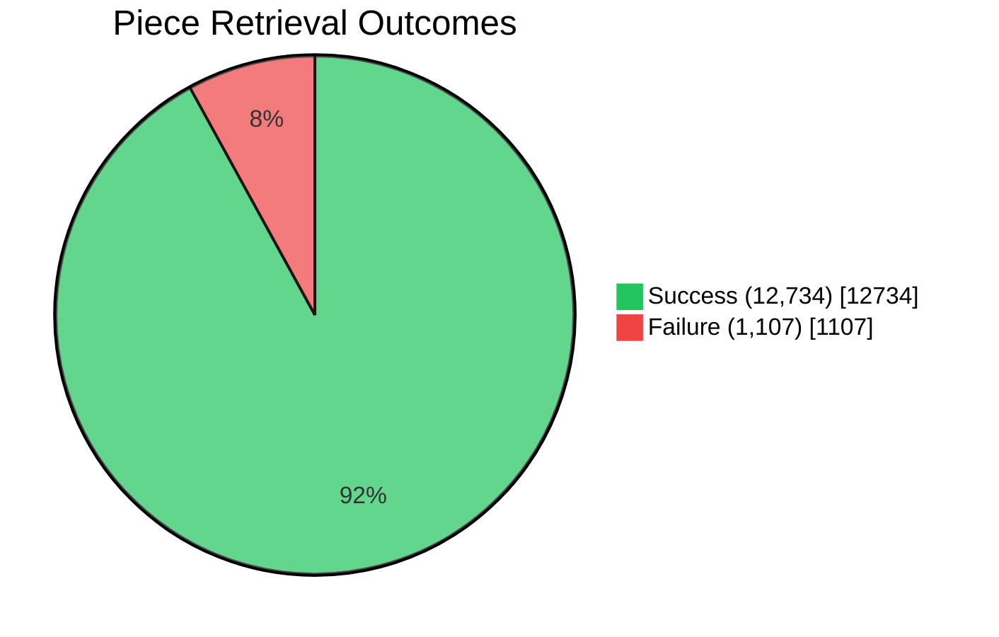
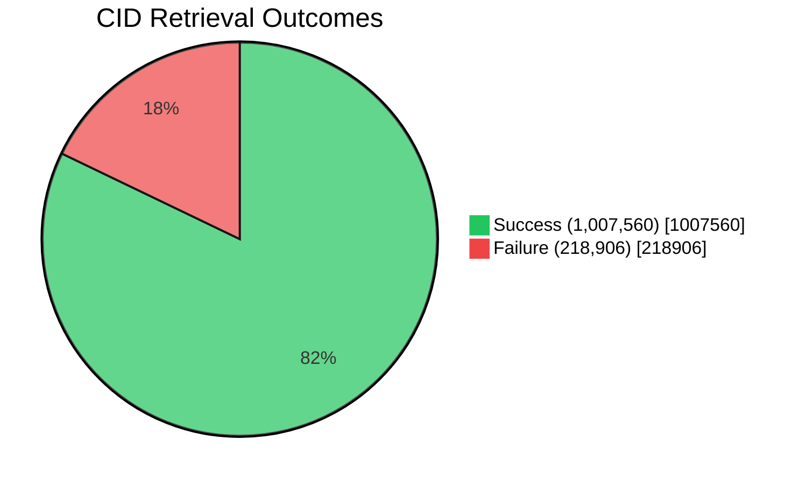
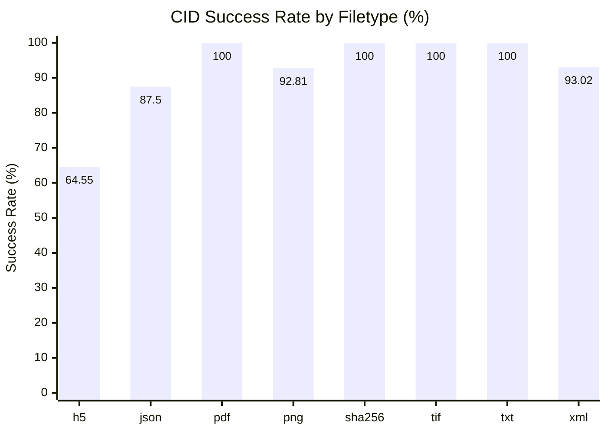
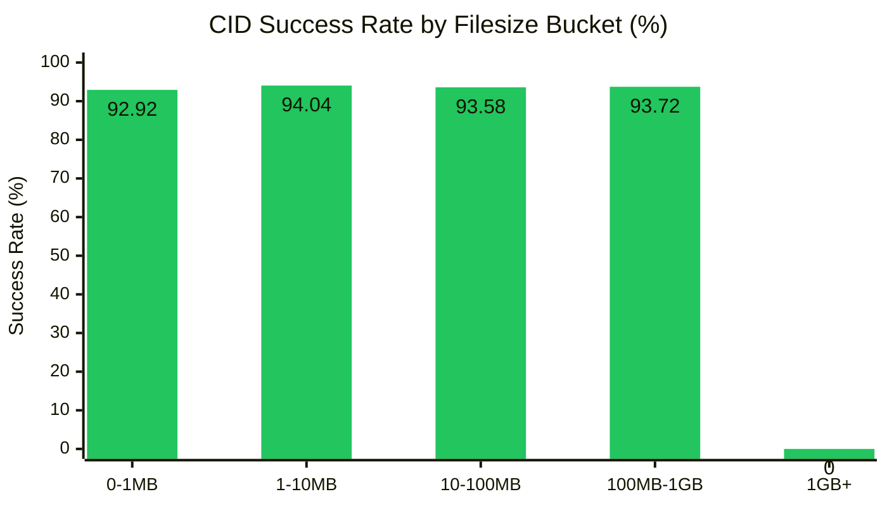
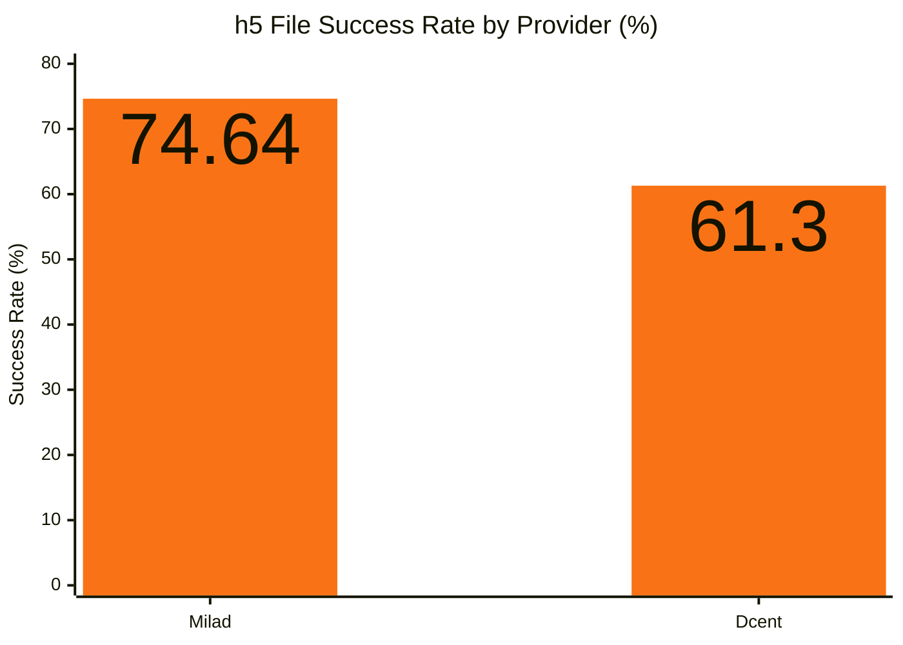
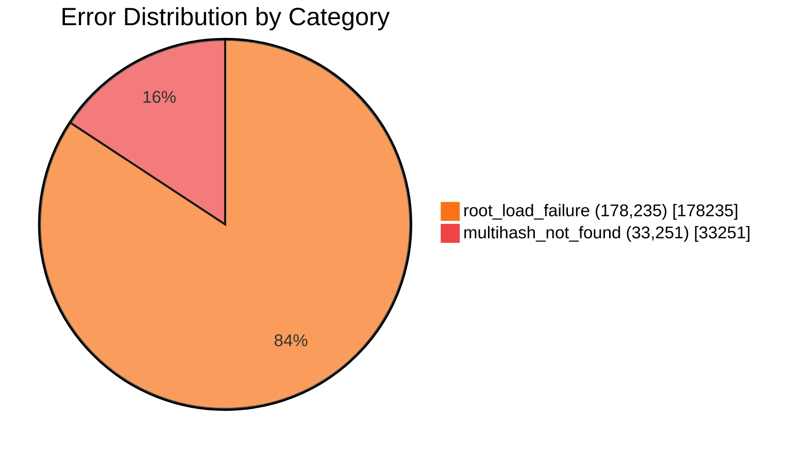
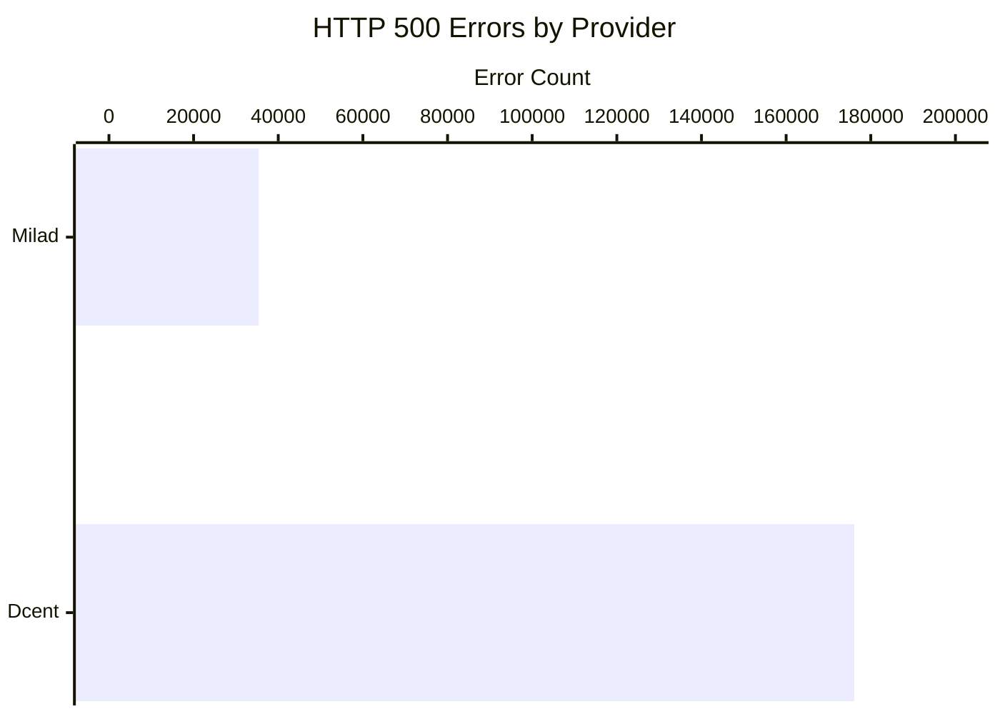
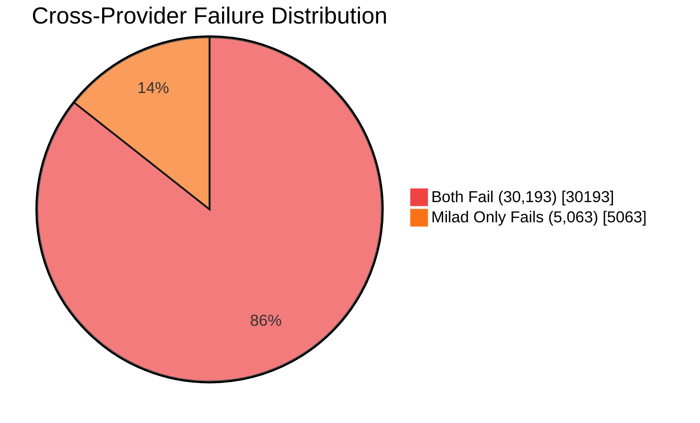
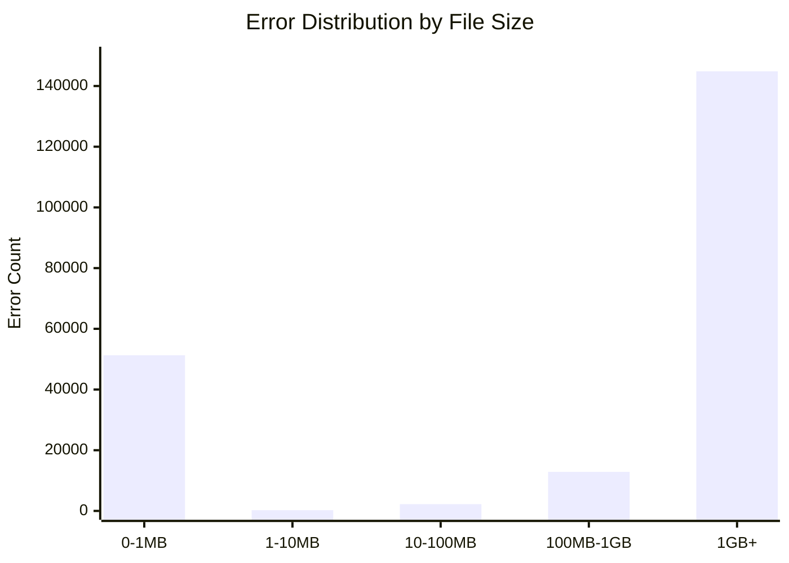

# Retrieval Summary Report

> **Source:** `summary_report.json`  
> **Generated:** 2025-12-05 01:11:32 UTC  
> **Dataset:** GEDI satellite observation data (Preps 1-7)  
> **Storage Providers:** Milad (f02639429), Dcent (f03493414)

---

## Executive Summary

This report analyzes retrieval performance for data stored across two storage providers. The analysis covers **10,399 unique pieces** and **847,390 unique CIDs** in active deals. The intent is to provide a comprehensive analysis of data retrievability of data collections prepared with Singularity and sealed by two Storage Providers (SPs) for storage on Filecoin. It evaluates retrieval success rates at both the **piece level** (sealed data) and **CID level** (individual files), broken down by preparation batch, storage provider, filetype, and filesize. The goal is to identify retrieval gaps, understand provider performance differences, and highlight systemic issues affecting data accessibility.

### Key Metrics at a Glance

| Metric | Value | Assessment |
| ------ | ----: | ---------- |
| Piece Success Rate | **92.00%** | ✅ Good |
| CID Success Rate | **82.15%** | ⚠️ Room for improvement |
| 1GB+ File Success Rate | **0.00%** | 🔴 Critical gap |
| CIDs with HTTP 500 Errors | **22.09%** | 🔴 Systemic failures |
| Best Provider | Milad (89.47% CID) | — |
| Worst Preparation | Prep 3 (57.34% CID) | — |

---

## Key Findings

1. **Large files (1GB+) cannot be retrieved** — 0% success rate across all providers and preparations. This affects **144,827 files** and is a systemic limitation requiring investigation.

2. **h5 files have the lowest success rate** (64.55% overall) compared to other filetypes. This is especially pronounced in Preparations 2 and 3 (27% success).

3. **Preparation 3 has the worst performance** — only 57.34% CID success rate and 71.97% piece success rate.

4. **Small files perform well** — Files under 1GB achieve 92–94% success rates.

5. **HTTP 500 errors are systemic, not provider-specific** — 22.09% of CIDs experience HTTP 500 errors, and the majority of affected CIDs fail on ALL providers, indicating underlying data unavailability rather than individual provider issues.

6. **Cross-provider failure pattern** — When a CID fails on one provider, it almost always fails on the other. Zero CIDs fail only on Dcent while succeeding on Milad, confirming that failures correlate with content properties (1GB+ h5 files) rather than provider infrastructure.

---

## Table of Contents

1. [Overall Retrieval](#1-overall-retrieval)
2. [Analysis by Dimension](#2-analysis-by-dimension)
   - [By Filetype](#21-by-filetype)
   - [By Filesize](#22-by-filesize)
   - [By Preparation](#23-by-preparation)
   - [By Provider](#24-by-provider)
3. [Detailed Breakdown by Preparation](#3-detailed-breakdown-by-preparation)
4. [Detailed Breakdown by Provider](#4-detailed-breakdown-by-provider)
5. [Prepared Content Analysis](#5-prepared-content-analysis)
6. [Retrieval Error Analysis](#6-retrieval-error-analysis)
   - [Error Overview](#error-overview)
   - [Error Distribution by Provider](#error-distribution-by-provider)
   - [Cross-Provider Failure Analysis](#cross-provider-failure-analysis)
   - [Error Characteristics by File Properties](#error-characteristics-by-file-properties)
7. [Appendix](#appendix)
   - [Methodology](#methodology)
   - [Non-Active Deals](#non-active-deals)
   - [Additional Charts](#additional-charts)

---

## 1. Overall Retrieval

### High-Level Counts

| Metric | Value |
| ------ | ----- |
| Unique pieces in active deals | 10,399 |
| Unique CIDs in active deals | 847,390 |
| Total piece retrieval checks | 13,841 |
| Total CID retrieval checks | 1,226,466 |

### Piece-Level Outcomes

| Metric | Value |
| ------ | ----- |
| With any provider success | 9,321 |
| All providers success | 9,292 |
| All providers failed | 1,078 |

### CID-Level Outcomes

| Metric | Value |
| ------ | ----- |
| With any provider success | 667,448 |
| All providers success | 658,664 |
| All providers failed | 179,942 |

---

## 2. Analysis by Dimension

### 2.1 By Filetype

| Filetype | Total Files | Success | Failure | Success Rate |
| -------- | ----------: | ------: | ------: | -----------: |
| h5       | 465,481 | 300,454 | 165,027 | **64.55%** |
| json     | 8 | 7 | 1 | 87.50% |
| pdf      | 6 | 6 | 0 | 100.00% |
| png      | 380,460 | 353,121 | 27,339 | 92.81% |
| sha256   | 25 | 25 | 0 | 100.00% |
| tif      | 25 | 25 | 0 | 100.00% |
| txt      | 4 | 4 | 0 | 100.00% |
| xml      | 380,457 | 353,918 | 26,539 | 93.02% |

> **Observation:** The **h5 (HDF5)** filetype shows a notably lower success rate of **64.55%** compared to other filetypes. This is significant because h5 files represent the largest category by volume (465,481 files). In contrast, **png** and **xml** files both achieve success rates above 92%.

---

### 2.2 By Filesize

| Filesize Bucket | Total Files | Success | Failure | Success Rate |
| --------------- | ----------: | ------: | ------: | -----------: |
| 0-1MB           | 761,108 | 707,226 | 53,882 | 92.92% |
| 1-10MB          | 5,416 | 5,093 | 323 | 94.04% |
| 10-100MB        | 51,673 | 48,353 | 3,320 | 93.58% |
| 100MB-1GB       | 263,442 | 246,888 | 16,554 | 93.72% |
| 1GB+            | 144,827 | 0 | 144,827 | **0.00%** |

> **🔴 Critical:** Files in the **1GB+ bucket have a 0% success rate**, indicating that large files cannot currently be retrieved. This represents **144,827 files** and is a critical gap requiring investigation. All other size buckets perform well, with success rates between 92–94%.

---

### 2.3 By Preparation

```mermaid
---
config:
    xyChart:
        width: 900
        height: 500
    themeVariables:
        xyChart:
            plotColorPalette: "#3b82f6, #22c55e"
---
xychart-beta
    title "Piece vs CID Success Rate by Preparation (%)"
    x-axis ["Prep 1", "Prep 2", "Prep 3", "Prep 6", "Prep 7"]
    y-axis "Success Rate (%)" 0 --> 110
    bar [100.00, 100.00, 71.97, 100.00, 99.18]
    bar [98.02, 74.71, 57.34, 100.00, 92.01]
```

> **Legend:** 🔵 Piece Success Rate | 🟢 CID Success Rate  
> **Note:** Preparations 4 and 5 are omitted as they have no active deals.

| Preparation | Piece Success Rate | CID Success Rate |
| ----------- | -----------------: | ---------------: |
| Prep 1      | 100.00% | 98.02% |
| Prep 2      | 100.00% | 74.71% |
| Prep 3      | 71.97% | 57.34% |
| Prep 6      | 100.00% | 100.00% |
| Prep 7      | 99.18% | 92.01% |

> **Observation:** Preparation 3 is a significant outlier with only 57.34% CID success rate and 71.97% piece success rate. Investigation required.

---

### 2.4 By Provider

| Provider | Piece Success Rate | CID Success Rate | h5 Success Rate |
| -------- | -----------------: | ---------------: | --------------: |
| Milad (f02639429) | 100.00% | 89.47% | 74.64% |
| Dcent (f03493414) | 89.69% | 78.66% | 61.30% |

> **Milad** outperforms **Dcent** across all metrics. However, both providers show 0% success for files 1GB+, indicating a systemic limitation rather than provider-specific issues.

---

## 3. Detailed Breakdown by Preparation

> **📊 Data Source Note:** The metrics in this section are derived from **retrieval check results** (`by_preparation` in `summary_report.json`) and are scoped to **active deals only**. For a view of **all prepared content** (including items not in active deals), see the [Prepared Content Analysis](#5-prepared-content-analysis) section.

### Preparation 1

#### Piece Metrics

| Metric | Value |
| ------ | ----- |
| Unique Pieces in active deals | 821 |
| Piece retrieval checks | 1,641 |
| Success count | 1,641 |
| Failure count | 0 |
| Success rate | **100.00%** |

#### CID Metrics

| Metric | Value |
| ------ | ----- |
| Unique CIDs in active deals | 255,128 |
| CID retrieval checks | 510,195 |
| Success count | 500,102 |
| Failure count | 10,093 |
| Success rate | 98.02% |

#### By Filetype

| Filetype | Total Files | Success | Failure | Success Rate |
| -------- | ----------: | ------: | ------: | -----------: |
| h5       | 170,065 | 166,982 | 3,083 | 98.19% |
| json     | 4 | 4 | 0 | 100.00% |
| png      | 170,060 | 166,187 | 3,873 | 97.72% |
| xml      | 170,066 | 166,929 | 3,137 | 98.16% |

#### By Filesize Bucket

| Filesize Bucket | Total Files | Success | Failure | Success Rate |
| --------------- | ----------: | ------: | ------: | -----------: |
| 0-1MB           | 340,240 | 333,230 | 7,010 | 97.94% |
| 1-10MB          | 2,344 | 2,292 | 52 | 97.78% |
| 10-100MB        | 25,189 | 24,728 | 461 | 98.17% |
| 100MB-1GB       | 142,422 | 139,852 | 2,570 | 98.20% |
| 1GB+            | 0 | 0 | 0 | N/A |

---

### Preparation 2

#### Piece Metrics

| Metric | Value |
| ------ | ----- |
| Unique Pieces in active deals | 5,286 |
| Piece retrieval checks | 7,907 |
| Success count | 7,907 |
| Failure count | 0 |
| Success rate | **100.00%** |

#### CID Metrics

| Metric | Value |
| ------ | ----- |
| Unique CIDs in active deals | 252,945 |
| CID retrieval checks | 376,901 |
| Success count | 281,576 |
| Failure count | 95,325 |
| Success rate | 74.71% |

#### By Filetype

| Filetype | Total Files | Success | Failure | Success Rate |
| -------- | ----------: | ------: | ------: | -----------: |
| h5       | 125,641 | 34,267 | 91,374 | **27.27%** |
| json     | 2 | 2 | 0 | 100.00% |
| png      | 125,622 | 123,398 | 2,224 | 98.23% |
| xml      | 125,636 | 123,909 | 1,727 | 98.63% |

#### By Filesize Bucket

| Filesize Bucket | Total Files | Success | Failure | Success Rate |
| --------------- | ----------: | ------: | ------: | -----------: |
| 0-1MB           | 251,269 | 247,318 | 3,951 | 98.43% |
| 1-10MB          | 1,298 | 1,294 | 4 | 99.69% |
| 10-100MB        | 2,507 | 2,488 | 19 | 99.24% |
| 100MB-1GB       | 30,699 | 30,476 | 223 | 99.27% |
| 1GB+            | 91,128 | 0 | 91,128 | **0.00%** |

> **Note:** Preparation 2 shows a dramatic drop in h5 file retrieval (27.27%) and complete failure for 1GB+ files.

---

### Preparation 3

#### Piece Metrics

| Metric | Value |
| ------ | ----- |
| Unique Pieces in active deals | 3,806 |
| Piece retrieval checks | 3,807 |
| Success count | 2,740 |
| Failure count | 1,067 |
| Success rate | **71.97%** |

#### CID Metrics

| Metric | Value |
| ------ | ----- |
| Unique CIDs in active deals | 254,210 |
| CID retrieval checks | 254,264 |
| Success count | 145,776 |
| Failure count | 108,488 |
| Success rate | 57.34% |

#### By Filetype

| Filetype | Total Files | Success | Failure | Success Rate |
| -------- | ----------: | ------: | ------: | -----------: |
| h5       | 84,756 | 22,742 | 62,014 | **26.83%** |
| json     | 1 | 0 | 1 | 0.00% |
| png      | 84,752 | 61,517 | 23,235 | 72.58% |
| xml      | 84,755 | 61,517 | 23,238 | 72.58% |

#### By Filesize Bucket

| Filesize Bucket | Total Files | Success | Failure | Success Rate |
| --------------- | ----------: | ------: | ------: | -----------: |
| 0-1MB           | 169,507 | 123,034 | 46,473 | 72.58% |
| 1-10MB          | 428 | 296 | 132 | 69.16% |
| 10-100MB        | 2,031 | 1,545 | 486 | 76.07% |
| 100MB-1GB       | 28,599 | 20,901 | 7,698 | 73.08% |
| 1GB+            | 53,699 | 0 | 53,699 | **0.00%** |

> **Note:** Preparation 3 has the lowest overall success rates. Piece-level retrieval is only 71.97%, and CID-level is 57.34%.

---

### Preparation 4 & 5

Preparations 4 and 5 have **no pieces or CIDs in active deals**. All data exists only in non-active deals.

---

### Preparation 6

#### Piece Metrics

| Metric | Value |
| ------ | ----- |
| Unique Pieces in active deals | 1 |
| Success rate | **100.00%** |

#### CID Metrics

| Metric | Value |
| ------ | ----- |
| Unique CIDs in active deals | 79 |
| Success rate | **100.00%** |

> Small dataset with perfect retrieval.

---

### Preparation 7

#### Piece Metrics

| Metric | Value |
| ------ | ----- |
| Unique Pieces in active deals | 485 |
| Piece retrieval checks | 485 |
| Success count | 481 |
| Failure count | 4 |
| Success rate | 99.18% |

#### CID Metrics

| Metric | Value |
| ------ | ----- |
| Unique CIDs in active deals | 85,029 |
| CID retrieval checks | 85,029 |
| Success count | 78,238 |
| Failure count | 6,791 |
| Success rate | 92.01% |

#### By Filetype

| Filetype | Total Files | Success | Failure | Success Rate |
| -------- | ----------: | ------: | ------: | -----------: |
| h5       | 85,019 | 78,228 | 6,791 | 92.01% |
| json     | 2 | 2 | 0 | 100.00% |
| pdf      | 4 | 4 | 0 | 100.00% |
| txt      | 4 | 4 | 0 | 100.00% |

#### By Filesize Bucket

| Filesize Bucket | Total Files | Success | Failure | Success Rate |
| --------------- | ----------: | ------: | ------: | -----------: |
| 0-1MB           | 66 | 63 | 3 | 95.45% |
| 1-10MB          | 1,346 | 1,238 | 108 | 91.98% |
| 10-100MB        | 21,920 | 20,189 | 1,731 | 92.10% |
| 100MB-1GB       | 61,697 | 56,748 | 4,949 | 91.98% |
| 1GB+            | 0 | 0 | 0 | N/A |

---

## 4. Detailed Breakdown by Provider

### Provider Milad (f02639429)

| Endpoint | `https://f02639429.infrafolio.com` |
| -------- | ---------------------------------- |

#### Piece Metrics

| Metric | Value |
| ------ | ----- |
| Pieces in active deals | 3,453 |
| Piece retrieval checks | 3,453 |
| Success count | 3,453 |
| Failure count | 0 |
| Success rate | **100.00%** |

#### CID Metrics

| Metric | Value |
| ------ | ----- |
| CIDs in active deals | 379,622 |
| CID retrieval checks | 379,622 |
| Success count | 339,651 |
| Failure count | 39,971 |
| Success rate | 89.47% |

#### By Filetype

| Filetype | Total Files | Success | Failure | Success Rate |
| -------- | ----------: | ------: | ------: | -----------: |
| h5       | 126,519 | 94,435 | 32,084 | 74.64% |
| json     | 3 | 3 | 0 | 100.00% |
| pdf      | 2 | 2 | 0 | 100.00% |
| png      | 126,531 | 121,975 | 4,556 | 96.40% |
| sha256   | 25 | 25 | 0 | 100.00% |
| tif      | 25 | 25 | 0 | 100.00% |
| xml      | 126,517 | 123,186 | 3,331 | 97.37% |

#### By Filesize Bucket

| Filesize Bucket | Total Files | Success | Failure | Success Rate |
| --------------- | ----------: | ------: | ------: | -----------: |
| 0-1MB           | 253,109 | 245,222 | 7,887 | 96.88% |
| 1-10MB          | 1,579 | 1,549 | 30 | 98.10% |
| 10-100MB        | 13,419 | 13,170 | 249 | 98.14% |
| 100MB-1GB       | 81,217 | 79,710 | 1,507 | 98.14% |
| 1GB+            | 30,298 | 0 | 30,298 | **0.00%** |

---

### Provider Dcent (f03493414)

| Endpoint | `http://212.6.53.56` |
| -------- | -------------------- |

#### Piece Metrics

| Metric | Value |
| ------ | ----- |
| Pieces in active deals | 10,388 |
| Piece retrieval checks | 10,388 |
| Success count | 9,317 |
| Failure count | 1,071 |
| Success rate | 89.69% |

#### CID Metrics

| Metric | Value |
| ------ | ----- |
| CIDs in active deals | 846,846 |
| CID retrieval checks | 846,846 |
| Success count | 666,120 |
| Failure count | 180,726 |
| Success rate | 78.66% |

#### By Filetype

| Filetype | Total Files | Success | Failure | Success Rate |
| -------- | ----------: | ------: | ------: | -----------: |
| h5       | 338,962 | 207,784 | 131,178 | 61.30% |
| json     | 7 | 6 | 1 | 85.71% |
| pdf      | 4 | 4 | 0 | 100.00% |
| png      | 253,929 | 229,153 | 24,776 | 90.24% |
| txt      | 4 | 4 | 0 | 100.00% |
| xml      | 253,940 | 229,169 | 24,771 | 90.25% |

#### By Filesize Bucket

| Filesize Bucket | Total Files | Success | Failure | Success Rate |
| --------------- | ----------: | ------: | ------: | -----------: |
| 0-1MB           | 508,001 | 458,451 | 49,550 | 90.25% |
| 1-10MB          | 3,837 | 3,571 | 266 | 93.07% |
| 10-100MB        | 38,254 | 35,806 | 2,448 | 93.60% |
| 100MB-1GB       | 182,225 | 168,292 | 13,933 | 92.35% |
| 1GB+            | 114,529 | 0 | 114,529 | **0.00%** |

---

## 5. Prepared Content Analysis

This section provides a consolidated view of retrievability metrics derived from file and piece metadata sources. This represents **all prepared content**, including items that may not be in active deals.

### Overall Metrics

#### CID Metrics Summary

| Metric | Value |
| ------ | ----- |
| Total files across all preparations | 1,624,311 |
| Unique CIDs | 851,033 |
| Retrievable by any provider | 666,554 |
| Retrievable by all providers | 661,478 |
| Not retrievable by any provider | 180,837 |
| Not in any active deals | 3,642 |

#### Piece Metrics Summary

| Metric | Value |
| ------ | ----- |
| Total pieces | 10,491 |
| Unique piece CIDs | 10,483 |
| Retrievable by any provider | 9,328 |
| Retrievable by all providers | 9,328 |
| Not retrievable by any provider | 1,071 |
| Not in any active deals | 84 |

> **⚠️ Metric Clarification:** "Retrievable by all providers" means retrievable by all providers **that have active deals for that specific CID/piece**. If a CID is only in deals with one provider, and that provider succeeds, it counts as "retrievable by all." This metric does **not** indicate cross-provider redundancy.
>
> **⚠️ Data Note:** There are 10,491 total pieces but only 10,483 unique piece CIDs, indicating **8 duplicate piece CIDs** across preparations. This warrants investigation.

### Provider Coverage Overview

| Provider | CID Retrievable | CID Not Retrievable | CID Not in Deals | Piece Retrievable | Piece Not Retrievable | Piece Not in Deals |
| -------- | --------------: | ------------------: | ---------------: | ----------------: | --------------------: | -----------------: |
| Milad (f02639429) | 339,651 | 39,971 | 471,411 | 3,453 | 0 | 7,030 |
| Dcent (f03493414) | 666,120 | 180,726 | 4,187 | 9,317 | 1,071 | 95 |

> **Note:** Dcent has significantly more CIDs in deals (covering most preparations), while Milad has a smaller footprint but perfect piece retrieval (0 failures).

### Preparation Source Files

| Prep | CID Source File | Piece Source File |
| ---: | --------------- | ----------------- |
| 1 | GEDI02_B_prep1_details.csv | GEDI02_B_prep1_details.json |
| 2 | GEDI01_B_prep2_details.csv | GEDI01_B_prep2_details.json |
| 3 | GEDI02_A_prep3_details.csv | GEDI02_A_prep3_details.json |
| 4 | GEDI_L4B_Gridded_Biomass_V2_1_2299_prep4_details.csv | GEDI_L4B_Gridded_Biomass_V2_1_2299_prep4_details.json |
| 5 | GEDI_L4A_AGB_Density_GW_2028_prep5_details.csv | GEDI_L4A_AGB_Density_GW_2028_prep5_details.json |
| 6 | GEDI_L3_LandSurface_Metrics_V2_1952_prep6_details.csv | GEDI_L3_LandSurface_Metrics_V2_1952_prep6_details.json |
| 7 | GEDI_L4A_AGB_Density_V2_1_2056_prep7_details.csv | GEDI_L4A_AGB_Density_V2_1_2056_prep7_details.json |

### Filetype Inventory by Preparation

| Prep | Dataset | Filetypes |
| ---: | ------- | --------- |
| 1 | GEDI02_B | h5, json, png, xml |
| 2 | GEDI01_B | h5, json, png, xml |
| 3 | GEDI02_A | h5, json, png, xml |
| 4 | GEDI_L4B_Gridded_Biomass | html, json, pdf, sha256, tif |
| 5 | GEDI_L4A_AGB_Density_GW | h5, json, pdf |
| 6 | GEDI_L3_LandSurface | json, pdf, png, sha256, tif |
| 7 | GEDI_L4A_AGB_Density_V2_1 | h5, json, pdf, txt |

> **Observation:** Preps 1-3 contain the main observation data (h5 HDF5 files with png/xml metadata). Preps 4-6 contain derived products like gridded biomass (tif) and land surface metrics. Prep 7 contains L4A aboveground biomass density estimates.

### Per-Preparation Provider Breakdown

#### Preparation 1 (GEDI02_B)

| Metric | Total | Milad | Dcent |
| ------ | ----: | ----: | -----: |
| CIDs Retrievable | 250,523 | 249,589 | 250,513 |
| CIDs Not Retrievable | 4,605 | 5,478 | 4,615 |
| CIDs Not in Deals | — | 61 | 0 |
| Pieces Retrievable | 821 | 820 | 821 |
| Pieces Not Retrievable | 0 | 0 | 0 |

#### Preparation 2 (GEDI01_B)

| Metric | Total | Milad | Dcent |
| ------ | ----: | ----: | -----: |
| CIDs Retrievable | 191,977 | 89,944 | 191,632 |
| CIDs Not Retrievable | 60,968 | 34,478 | 60,847 |
| CIDs Not in Deals | — | 130,747 | 2,690 |
| Pieces Retrievable | 5,286 | 2,631 | 5,276 |
| Pieces Not Retrievable | 0 | 0 | 0 |

> **Note:** Milad has 130,747 CIDs not in deals for Prep 2, explaining lower retrievability from this provider.

#### Preparation 3 (GEDI02_A)

| Metric | Total | Milad | Dcent |
| ------ | ----: | ----: | -----: |
| CIDs Retrievable | 145,738 | 40 | 145,738 |
| CIDs Not Retrievable | 108,473 | 15 | 108,473 |
| CIDs Not in Deals | — | 255,159 | 1,003 |
| Pieces Retrievable | 2,739 | 1 | 2,739 |
| Pieces Not Retrievable | 1,067 | 0 | 1,067 |

> **Critical:** Prep 3 is almost entirely on Dcent provider. Milad has only 40 retrievable CIDs and 255,159 not in deals.

#### Preparation 4 (GEDI_L4B_Gridded_Biomass)

| Metric | Total | Milad | Dcent |
| ------ | ----: | ----: | -----: |
| Total Files | 62 | — | — |
| Unique CIDs | 25 | — | — |
| CIDs Retrievable | 1 | 1 | 1 |
| CIDs Not Retrievable | 0 | 0 | 0 |
| CIDs Not in Deals | 24 | 24 | 24 |
| Total Pieces | 2 | — | — |
| Pieces Retrievable | 0 | 0 | 0 |
| Pieces Not in Deals | 2 | 2 | 2 |

> **Note:** Almost all content (24 of 25 CIDs) is not in any active deals.

#### Preparation 5 (GEDI_L4A_AGB_Density_GW)

| Metric | Total | Milad | Dcent |
| ------ | ----: | ----: | -----: |
| Total Files | 2,318 | — | — |
| Unique CIDs | 392 | — | — |
| CIDs Retrievable | 1 | 1 | 1 |
| CIDs Not Retrievable | 0 | 0 | 0 |
| CIDs Not in Deals | 391 | 391 | 391 |
| Total Pieces | 11 | — | — |
| Pieces Retrievable | 0 | 0 | 0 |
| Pieces Not in Deals | 11 | 11 | 11 |

> **Note:** Almost all content (391 of 392 CIDs) is not in any active deals.

#### Preparation 6 (GEDI_L3_LandSurface)

| Metric | Total | Milad | Dcent |
| ------ | ----: | ----: | -----: |
| Total Files | 777 | — | — |
| Unique CIDs | 80 | — | — |
| CIDs Retrievable | 80 | 80 | 1 |
| CIDs Not Retrievable | 0 | 0 | 0 |
| CIDs Not in Deals | 0 | 0 | 79 |
| Total Pieces | 2 | — | — |
| Pieces Retrievable | 1 | 1 | 0 |
| Pieces Not in Deals | 1 | 1 | 2 |

> **Note:** Milad has 100% CID coverage (80/80 retrievable), while Dcent has only 1 CID in deals.

#### Preparation 7 (GEDI_L4A_AGB_Density_V2_1)

| Metric | Total | Milad | Dcent |
| ------ | ----: | ----: | -----: |
| CIDs Retrievable | 78,238 | 0 | 78,238 |
| CIDs Not Retrievable | 6,791 | 0 | 6,791 |
| CIDs Not in Deals | — | 85,029 | 0 |
| Pieces Retrievable | 481 | 0 | 481 |
| Pieces Not Retrievable | 4 | 0 | 4 |

> **Critical:** Prep 7 is exclusively on Dcent provider. Milad has 0 retrievable and 85,029 not in deals.

### Filesize Distribution by Preparation

| Prep | 0-1MB | 1-10MB | 10-100MB | 100MB-1GB | 1GB+ | Total |
| ---: | ----: | -----: | -------: | --------: | ---: | ----: |
| 1 | 170,140 | 1,172 | 12,596 | 71,220 | 0 | 255,128 |
| 2 | 170,119 | 902 | 1,722 | 20,894 | 61,532 | 255,169 |
| 3 | 170,140 | 429 | 2,039 | 28,686 | 53,920 | 255,214 |
| 4 | 13 | 2 | 5 | 5 | 0 | 25 |
| 5 | 5 | 1 | 0 | 333 | 53 | 392 |
| 6 | 29 | 0 | 26 | 25 | 0 | 80 |
| 7 | 66 | 1,346 | 21,920 | 61,697 | 0 | 85,029 |
| **Total** | **510,512** | **3,852** | **38,308** | **182,860** | **115,505** | **851,037** |

> **Key Observations:**
>
> - **1GB+ files** exist only in Preps 2, 3, and 5. These are the files with 0% retrieval success.
> - **Preps 1-3** have similar distributions in the 0-1MB bucket (~170K each) due to matching png/xml metadata files.
> - **Prep 7** has the most files in the 100MB-1GB range (61,697 CIDs), all h5 observation data.

---

## 6. Retrieval Error Analysis

This section provides a deep-dive into HTTP 500 errors to understand root causes of retrieval failures. By categorizing error messages and analyzing patterns across providers, preparations, and file characteristics, we can identify systemic issues and prioritize remediation efforts.

> **📊 Scope:** Active deals only. Analyzes CID-level retrieval check results where HTTP status code = 500.

### Error Overview

| Metric | Value |
| ------ | ----: |
| Total HTTP 500 errors | 211,486 |
| Unique CIDs with any 500 error | 181,293 |
| CIDs where all providers failed | 176,230 |
| Percentage of active deal CIDs affected | **22.09%** |

> **Key Insight:** Over 1 in 5 CIDs with active deals (22.09%) experience HTTP 500 errors. The vast majority (176,230 CIDs) fail across **all** providers, indicating systemic data availability issues rather than provider-specific problems.

---

### Error Distribution by Provider

The two storage providers exhibit distinctly different error profiles:

| Provider | Total 500 Errors | Primary Error Category | Top Pattern |
| -------- | ---------------: | --------------------- | ----------- |
| Milad (f02639429) | 35,376 | multihash_not_found (94%) | "multihash \<HASH\>: not found" |
| Dcent (f03493414) | 176,110 | root_load_failure (100%) | "ipld: could not find node" |

#### Milad Error Breakdown

| Category | Count | Percentage |
| -------- | ----: | ---------: |
| multihash_not_found | 33,251 | 93.99% |
| root_load_failure | 2,125 | 6.01% |

**Top error patterns (Milad):**

1. `failed to load root node: failed to load root CID: getting pieces containing cid <CID>: multihash <HASH>: not found` — **33,139 occurrences (93.7%)**
2. `...reading data for block <CID> from reader for piece <PIECE_CID>: unexpected EOF` — 540 occurrences (1.5%)
3. `...malformed car; header is bigger than util.MaxAllowedSectionSize` — 60 occurrences (0.2%)

> **Interpretation:** Milad's primary error (93.7%) indicates the content hash cannot be located in the piece index. This suggests either incomplete piece data or index corruption.

#### Dcent Error Breakdown

| Category | Count | Percentage |
| -------- | ----: | ---------: |
| root_load_failure | 176,110 | 100.00% |

**Top error pattern (Dcent):**

1. `failed to load root node: failed to load root CID: ipld: could not find node` — **176,110 occurrences (100%)**

> **Interpretation:** Dcent shows a single, uniform error pattern. The "could not find node" message indicates the IPLD node corresponding to the CID root cannot be resolved. This may indicate missing data blocks or incomplete CAR file ingestion.

---

### Cross-Provider Failure Analysis

To distinguish between provider-specific issues and systemic data problems, we analyzed CIDs that have active deals with **both** providers:

| Metric | Value |
| ------ | ----: |
| CIDs with deals on both providers | 35,256 |
| Both providers fail | 30,193 (85.6%) |
| Only Milad fails | 5,063 (14.4%) |
| Only Dcent fails | 0 (0.0%) |

> **🔴 Critical Finding:** When a CID fails retrieval on Dcent, it **always** also fails on Milad (0 Dcent-only failures). This strongly suggests the underlying data is unavailable, not that Dcent has unique serving issues.

#### Characteristics of Shared Failures

All 30,193 CIDs that fail on both providers share these characteristics:

| Attribute | Value |
| --------- | ----- |
| File type | **100% h5 (HDF5)** |
| File size | **100% 1GB+** |
| Preparations | Prep 2 (30,178), Prep 3 (15) |

**Error category combination:**
- Milad returns: `multihash_not_found`
- Dcent returns: `root_load_failure`

> **Root Cause Hypothesis:** The 1GB+ h5 files in Preparations 2 and 3 appear to have incomplete or corrupted data in the sealed pieces. Both providers cannot serve these files, but they report the failure differently based on their implementation.

---

### Error Characteristics by File Properties

#### By Error Category and File Size

| Error Category | 0-1MB | 1-10MB | 10-100MB | 100MB-1GB | 1GB+ | **% 1GB+** |
| -------------- | ----: | -----: | -------: | --------: | ---: | ---------: |
| multihash_not_found | 2,696 | 4 | 19 | 223 | 30,309 | **91.1%** |
| root_load_failure | 48,582 | 240 | 2,217 | 12,646 | 114,550 | **64.3%** |

> **Pattern:** Large files (1GB+) account for the overwhelming majority of errors:
> - 91.1% of `multihash_not_found` errors are 1GB+ files
> - 64.3% of `root_load_failure` errors are 1GB+ files
> - Combined: 144,859 errors (68.5% of all 500 errors) come from 1GB+ files

#### By Error Category and File Type

| Error Category | h5 | png | xml | json |
| -------------- | -: | --: | --: | ---: |
| multihash_not_found | 30,555 | 1,714 | 982 | 0 |
| root_load_failure | 129,655 | 24,531 | 24,048 | 1 |
| **Total** | **160,210** | **26,245** | **25,030** | **1** |

> **File Type Impact:** h5 files account for 75.8% of all HTTP 500 errors (160,210 of 211,486), correlating with their large file sizes.

---

### Error Distribution by Preparation

| Preparation | Total 500 Errors | multihash_not_found | root_load_failure |
| ----------: | ---------------: | ------------------: | ----------------: |
| 1 | 873 | 864 (99.0%) | 9 (1.0%) |
| 2 | 95,347 | 32,372 (33.9%) | 62,975 (66.1%) |
| 3 | 108,475 | 15 (0.01%) | 108,460 (99.99%) |
| 7 | 6,791 | 0 (0%) | 6,791 (100%) |

> **Observations:**
> - **Prep 3** has the highest error count (108,475) and is dominated by `root_load_failure` errors
> - **Prep 2** shows a mix of both error categories
> - **Prep 1** has minimal errors (873), mostly `multihash_not_found`
> - **Preps 4, 5, 6** have no HTTP 500 errors recorded

---

### Summary: Error Analysis Key Takeaways

1. **🔴 Systemic Issue:** 22.1% of CIDs in active deals experience HTTP 500 errors, with 97% of affected CIDs failing across all providers.

2. **📁 File Size is the Primary Factor:** 1GB+ files account for 68.5% of all errors and have a 0% retrieval success rate. This is the single biggest issue affecting data retrievability.

3. **📊 h5 Files Most Affected:** HDF5 files represent 75.8% of all HTTP 500 errors due to their large file sizes.

4. **🔄 Cross-Provider Pattern:** When Dcent fails, Milad always fails too — indicating the underlying data is unavailable rather than provider-serving issues.

5. **📋 Prep 2 & 3 Are Primary Sources:** These preparations contain the 1GB+ h5 files causing most failures.

**Recommended Actions:**
- Investigate the sealing/preparation process for 1GB+ files in Preps 2 and 3
- Verify CAR file integrity for pieces containing large h5 files
- Consider re-preparing the affected content with updated tooling

---

## Appendix

### Methodology

#### Data Collection Process

1. **Deal Enumeration:** Queried Filecoin chain state for all active storage deals containing GEDI data pieces
2. **Retrieval Testing:** Performed HTTP retrievals for each piece and CID against storage provider endpoints
3. **Result Aggregation:** Collected success/failure outcomes with error categorization

#### How Retrieval Checks Were Performed

Retrieval status was determined using the `check_retrieval_status.py` script:

1. **Piece-level checks**: HTTP HEAD/GET requests to `/piece/{piece_cid}` endpoints on each provider's Curio gateway
2. **CID-level checks**: HTTP HEAD/GET requests to `/ipfs/{cid}` endpoints (IPFS trustless gateway format)

A retrieval is marked **successful** if the endpoint returns HTTP 200. Failures include HTTP errors, timeouts (30s limit), and connection errors.

#### Provider Endpoints

| Provider | Address | Endpoint URL |
| -------- | ------- | ------------ |
| Milad | f02639429 | <https://f02639429.infrafolio.com> |
| Dcent | f03493414 | <http://212.6.53.56> |

#### Active Deals Scope

A deal is considered **active** if its `state` field in `deals.json` equals `"active"`. Deals in other states (e.g., `proposed`, `published`, `expired`, `slashed`) are excluded from the primary metrics.

#### Metrics Definitions

- **Piece:** A Filecoin storage unit (typically 32GiB or 64GiB sector-aligned data)
- **CID:** Content Identifier - unique hash of a file's content
- **Retrieval Check:** HTTP HEAD or GET request to verify data availability
- **Success Rate:** (Successful retrievals / Total retrieval attempts) × 100

---

### Non-Active Deals

| Metric | Value |
| ------ | ----- |
| Unique pieces not in active deals | 7,033 |
| Unique CIDs not in active deals | 471,956 |
| Piece retrieval checks (non-active) | 7,109 |
| CID retrieval checks (non-active) | 475,598 |

> **⚠️ Metric Clarification:** "Unique pieces/CIDs not in active deals" counts **distinct items** that were checked but have no active storage deals. "Retrieval checks (non-active)" counts the **total retrieval attempts** against those items. The difference (e.g., 7,109 - 7,033 = 76 for pieces) represents items checked against multiple providers.

These represent data that was checked but is not currently in active storage deals.

---

### Additional Charts

For comprehensive visualizations including:

- Provider coverage charts by preparation
- CID distribution comparisons
- Filesize distribution by preparation
- Success/failure stacked charts

See the companion document: **[retrieval_charts.md](./retrieval_charts.md)**

---

*Report generated from `summary_report.json` on 2025-12-05 01:11:32 UTC.*
