# Retrieval Metrics Charts

> **📊 Companion Document**  
> This is the visualization gallery for the [Retrieval Summary Report](./RETRIEVAL_SUMMARY_REPORT.md). It contains all 22 charts for deep-dive analysis.
>
> **Note:** Charts 1-4, 6, and 7 are also embedded inline in the main summary report for narrative context. This file serves as the complete reference for all visualizations.

This document contains Mermaid diagrams visualizing the retrieval metrics from `summary_report.json`.

**Chart Index:**

| Section | Charts | Description |
|---------|--------|-------------|
| Core Metrics | 1-5 | Overall outcomes, filetype & filesize analysis |
| Preparation Analysis | 6, 10 | Success rates by preparation batch |
| Provider Comparison | 7-9 | Milad vs Dcent performance |
| Distribution | 11-12 | File counts and retrieval status |
| Provider Coverage | 13-16 | CID coverage and deal gaps by provider |
| Prepared Content | 17-20 | All prepared content (including non-active deals) |
| Error Analysis | 21-22 | HTTP 500 error patterns and categories |

---

## 1. Piece Retrieval Outcomes (Pie Chart)

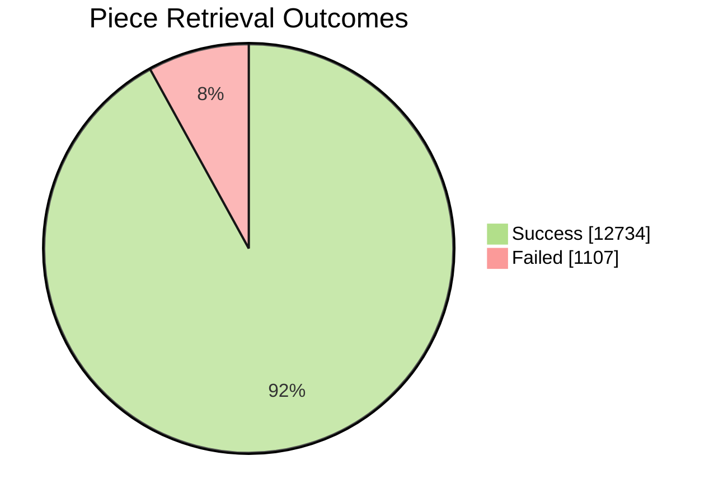
```mermaid
%%{init: {"themeVariables": {
  "pie1": "#b2df8a",
  "pie2": "#fb9a99"
}} }%%
pie showData
    title Piece Retrieval Outcomes
    "Success" : 12734
    "Failed" : 1107
```

---

## 2. CID Retrieval Outcomes (Pie Chart)

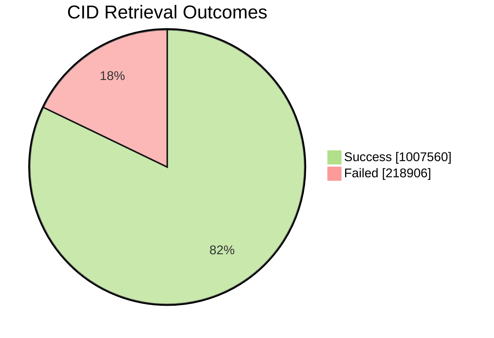
```mermaid
%%{init: {"themeVariables": {
  "pie1": "#b2df8a",
  "pie2": "#fb9a99"
}} }%%
pie showData
    title CID Retrieval Outcomes
    "Success" : 1007560
    "Failed" : 218906
```

---

## 3. Success Rate by Filetype (Bar Chart)

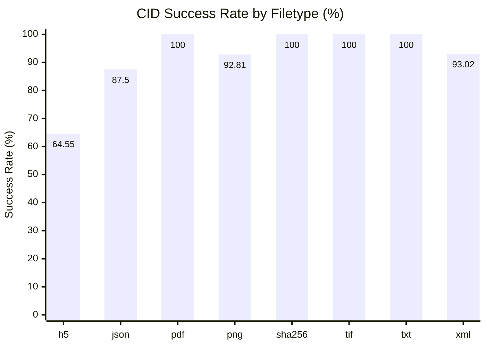
```mermaid
---
config:
    xyChart:
        showDataLabel: true
---
xychart-beta
    title "CID Success Rate by Filetype (%)"
    x-axis [h5, json, pdf, png, sha256, tif, txt, xml]
    y-axis "Success Rate (%)" 0 --> 100
    bar [64.55, 87.50, 100.00, 92.81, 100.00, 100.00, 100.00, 93.02]
```

---

## 4. Success Rate by Filesize Bucket (Bar Chart)

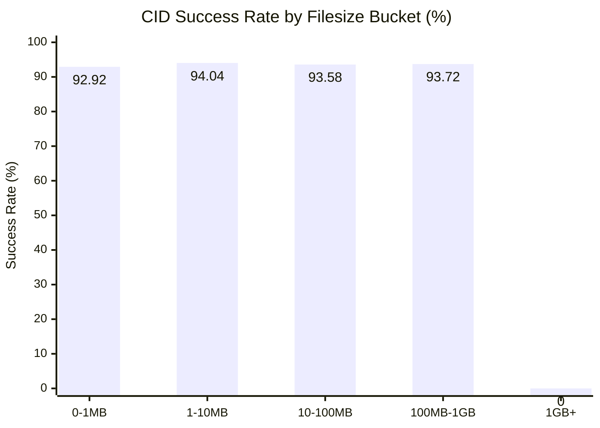
```mermaid
---
config:
    xyChart:
        showDataLabel: true
---
xychart-beta
    title "CID Success Rate by Filesize Bucket (%)"
    x-axis ["0-1MB", "1-10MB", "10-100MB", "100MB-1GB", "1GB+"]
    y-axis "Success Rate (%)" 0 --> 100
    bar [92.92, 94.04, 93.58, 93.72, 0.00]
```

---

## 5. File Distribution by Filesize Bucket (Bar Chart)

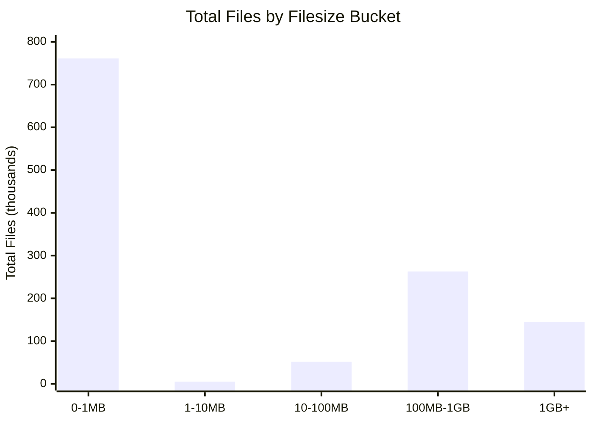
```mermaid
---
config:
    xyChart:
        showDataLabel: true
---
xychart-beta
    title "Total Files by Filesize Bucket"
    x-axis ["0-1MB", "1-10MB", "10-100MB", "100MB-1GB", "1GB+"]
    y-axis "Total Files (thousands)" 0 --> 800
    bar [761, 5, 52, 263, 145]
```

---

## 6. Piece vs CID Success Rate by Preparation (Bar Chart)

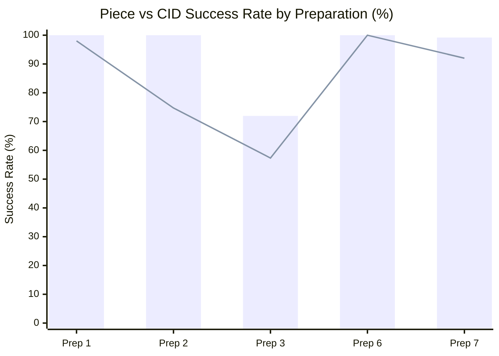
```mermaid
xychart-beta
    title "Piece vs CID Success Rate by Preparation (%)"
    x-axis ["Prep 1", "Prep 2", "Prep 3", "Prep 6", "Prep 7"]
    y-axis "Success Rate (%)" 0 --> 100
    bar [100.00, 100.00, 71.97, 100.00, 99.18]
    line [98.02, 74.71, 57.33, 100.00, 92.01]
```

> **Legend:** Bars = Piece Success Rate | Line = CID Success Rate

---

## 7. h5 File Success Rate by Provider (Bar Chart)

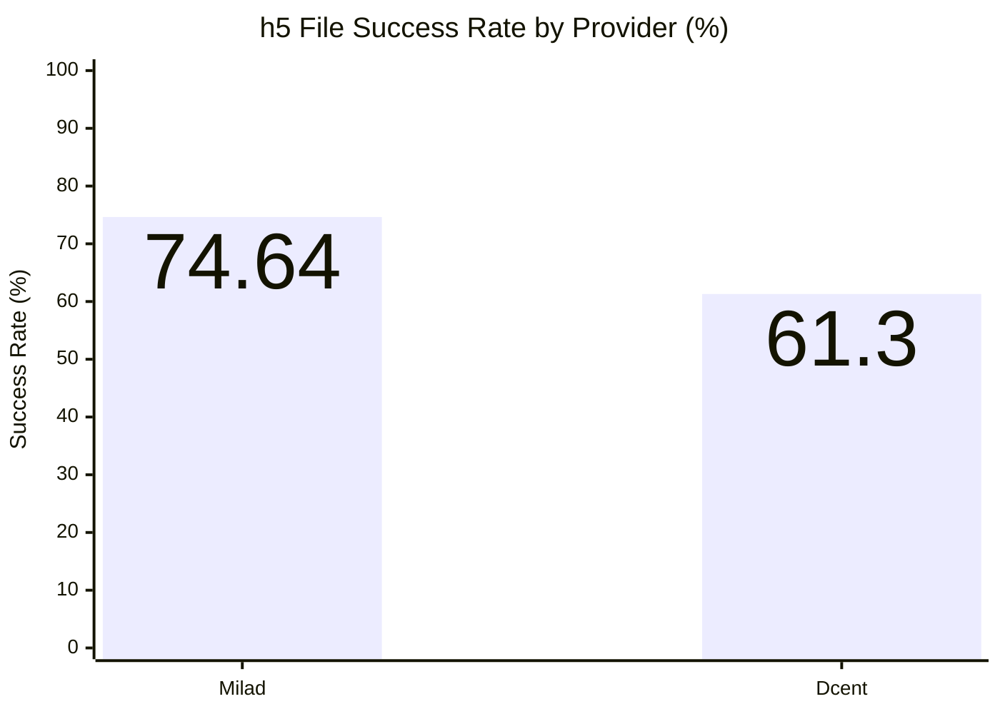
```mermaid
---
config:
    xyChart:
        showDataLabel: true
---
xychart-beta
    title "h5 File Success Rate by Provider (%)"
    x-axis ["Milad", "Dcent"]
    y-axis "Success Rate (%)" 0 --> 100
    bar [74.64, 61.30]
```

---

## 8. Milad: Success Rate by Filesize Bucket

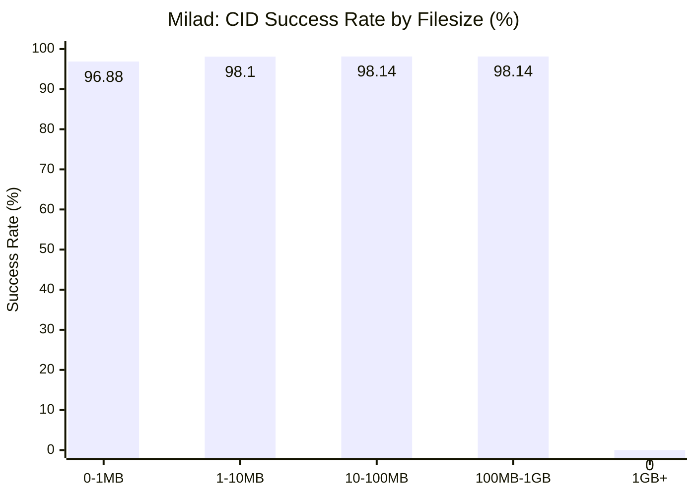
```mermaid
---
config:
    xyChart:
        showDataLabel: true
---
xychart-beta
    title "Milad: CID Success Rate by Filesize (%)"
    x-axis ["0-1MB", "1-10MB", "10-100MB", "100MB-1GB", "1GB+"]
    y-axis "Success Rate (%)" 0 --> 100
    bar [96.88, 98.10, 98.14, 98.14, 0.00]
```

---

## 9. Dcent: Success Rate by Filesize Bucket

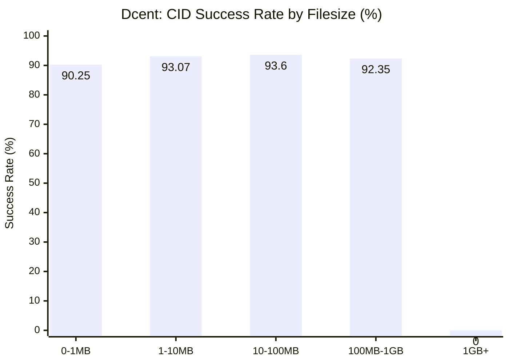
```mermaid
---
config:
    xyChart:
        showDataLabel: true
---
xychart-beta
    title "Dcent: CID Success Rate by Filesize (%)"
    x-axis ["0-1MB", "1-10MB", "10-100MB", "100MB-1GB", "1GB+"]
    y-axis "Success Rate (%)" 0 --> 100
    bar [90.25, 93.07, 93.60, 92.35, 0.00]
```

---

## 10. h5 Success Rate by Preparation (Bar Chart)

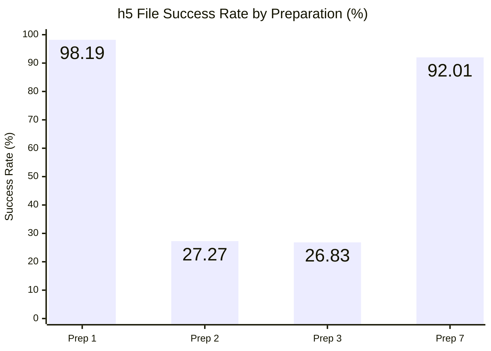
```mermaid
---
config:
    xyChart:
        showDataLabel: true
---
xychart-beta
    title "h5 File Success Rate by Preparation (%)"
    x-axis ["Prep 1", "Prep 2", "Prep 3", "Prep 7"]
    y-axis "Success Rate (%)" 0 --> 100
    bar [98.19, 27.27, 26.83, 92.01]
```

---

## 11. Files by Filetype Distribution (Pie Chart)

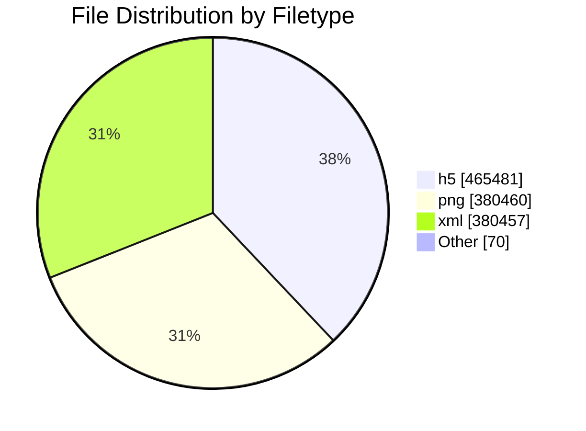
```mermaid
pie showData
    title File Distribution by Filetype
    "h5" : 465481
    "png" : 380460
    "xml" : 380457
    "Other" : 70
```

---

## 12. Retrieval Checks by Filetype - Success vs Failure (Stacked View)

This chart shows the total retrieval checks by filetype, with separate bars for successful (green) and failed (red) retrievals.

```mermaid
---
config:
    xyChart:
        width: 900
        height: 500
    themeVariables:
        xyChart:
            plotColorPalette: "#22c55e, #ef4444"
---
xychart-beta
    title "CID Retrieval Status Check by Filetype (thousands)"
    x-axis [h5, png, xml]
    y-axis "Files (thousands)" 0 --> 400
    bar [302, 351, 352]
    bar [163, 29, 28]
```

> **Legend:** 🟢 First bar (green) = Success Count | 🔴 Second bar (red) = Failure Count
> Filetypes with negligible counts (json, pdf, sha256, tif, txt) are omitted for clarity. See data breakdown below for full details.

**Retrieval Status Check Breakdown:**

| Filetype | Success | Failure | Total |
|----------|--------:|--------:|------:|
| h5       | 302,219 | 163,262 | 465,481 |
| png      | 351,128 | 29,332 | 380,460 |
| xml      | 352,355 | 28,102 | 380,457 |
| json     | 9 | 1 | 10 |
| pdf      | 6 | 0 | 6 |
| sha256   | 25 | 0 | 25 |
| tif      | 25 | 0 | 25 |
| txt      | 4 | 0 | 4 |

---

## Summary

These charts provide visual representations of:

1. **Overall retrieval performance** - Pie charts showing success/failure distributions
2. **Filetype analysis** - Bar charts comparing success rates across filetypes
3. **Filesize impact** - Clear visualization of the 1GB+ retrieval failure issue
4. **Preparation comparison** - Line and bar charts showing variation across preparations
5. **Provider comparison** - Side-by-side comparison of Milad vs Dcent performance

### Key Visual Insights

- **Chart 4** clearly shows the 0% success rate cliff for 1GB+ files
- **Chart 6** reveals Preparation 3 as a significant outlier with ~57% success
- **Chart 10** highlights the dramatic h5 retrieval problems in Preparations 2 and 3
- **Charts 8-9** show Milad consistently outperforming Dcent across all size buckets

---

## Provider Coverage Charts

### 13. Provider CID Coverage by Preparation

This chart shows total unique CIDs per preparation alongside retrievable CIDs for each provider.

```mermaid
---
config:
    xyChart:
        width: 900
        height: 500
    themeVariables:
        xyChart:
            plotColorPalette: "#18191aff, #f97316, #3b82f6"
---
xychart-beta
    title "Unique CIDs vs Retrievable CIDs by Provider (thousands)"
    x-axis ["Prep 1", "Prep 2", "Prep 3", "Prep 4", "Prep 5", "Prep 6", "Prep 7"]
    y-axis "CIDs (thousands)" 0 --> 280
    bar [255, 255, 255, 0.025, 0.392, 0.080, 85]
    bar [251, 192, 146, 0.001, 0.001, 0.001, 78]
    bar [250, 90, 0.040, 0.001, 0.001, 0.080, 0]
```

> **Legend:** ⚫ Bar 1 = Unique CIDs | 🟠 Bar 2 = Dcent Retrievable | 🔵 Bar 3 = Milad Retrievable
> Note: Milad has nearly 0 retrievable CIDs for Preps 3 and 7; Dcent is the primary provider for those preparations.

| Preparation | Unique CIDs | Milad Retrievable | Dcent Retrievable |
|-------------|------------:|------------------:|-------------------:|
| Prep 1 | 255,128 | 249,589 | 250,513 |
| Prep 2 | 255,169 | 89,944 | 191,632 |
| Prep 3 | 255,214 | 40 | 145,738 |
| Prep 4 | 25 | 1 | 1 |
| Prep 5 | 392 | 1 | 1 |
| Prep 6 | 80 | 80 | 1 |
| Prep 7 | 85,029 | 0 | 78,238 |

---

### 14. Unique CIDs vs Missing or Non-Retrievable CIDs by Provider

This chart shows total unique CIDs per preparation (bars) with lines indicating not-retrievable CIDs for each provider, plus CIDs not in active deals from Milad.

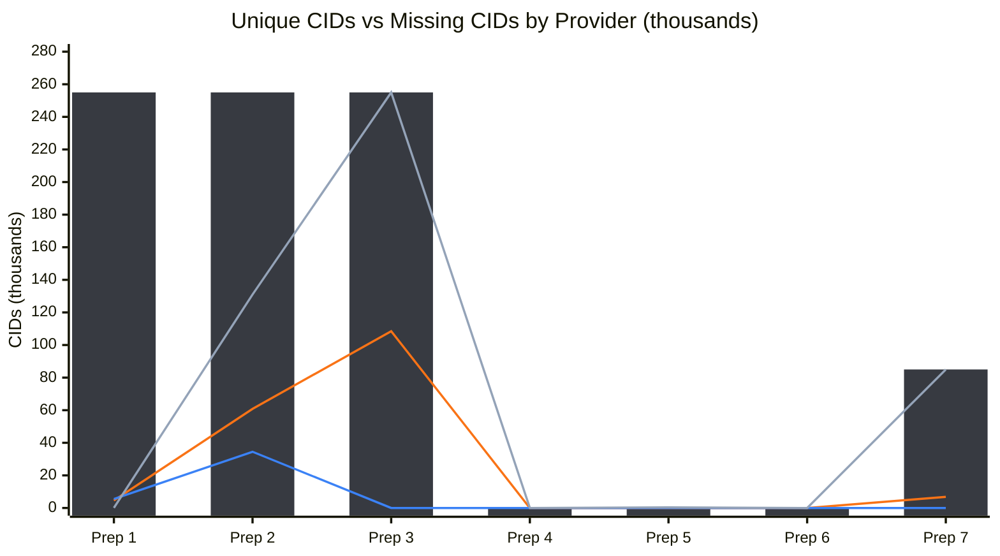
```mermaid
---
config:
    xyChart:
        width: 900
        height: 500
    themeVariables:
        xyChart:
            plotColorPalette: "#373a41ff, #f97316, #3b82f6, #94a3b8"
---
xychart-beta
    title "Unique CIDs vs Missing CIDs by Provider (thousands)"
    x-axis ["Prep 1", "Prep 2", "Prep 3", "Prep 4", "Prep 5", "Prep 6", "Prep 7"]
    y-axis "CIDs (thousands)" 0 --> 280
    bar [255, 255, 255, 0.025, 0.392, 0.080, 85]
    line [4.6, 60.8, 108.5, 0, 0, 0, 6.8]
    line [5.5, 34.5, 0.015, 0, 0, 0, 0]
    line [0.061, 131, 255, 0.024, 0.391, 0, 85]
```

> **Legend:** ⚫ Bar : Unique CIDs | 🟠 Line 1 : Dcent - Not Retrievable | 🔵 Line 2 : Milad - Not Retrievable | ⚪ Line 3 : Milad - Not in Deals
> **Critical Finding:** Milad has 255K CIDs not in deals for Prep 3 and 131K for Prep 2, explaining their low coverage. Dcent has 108K not retrievable in Prep 3.

| Preparation | Unique CIDs | Dcent - Not Retrievable | Milad - Not Retrievable | Milad - Not in Deals |
|-------------|------------:|-----------------------:|----------------------:|-------------------:|
| Prep 1 | 255,128 | 4,615 | 5,478 | 61 |
| Prep 2 | 255,169 | 60,847 | 34,478 | 130,747 |
| Prep 3 | 255,214 | 108,473 | 15 | 255,159 |
| Prep 4 | 25 | 0 | 0 | 24 |
| Prep 5 | 392 | 0 | 0 | 391 |
| Prep 6 | 80 | 0 | 0 | 0 |
| Prep 7 | 85,029 | 6,791 | 0 | 85,029 |

---

### 15. Overall Provider CID Metrics

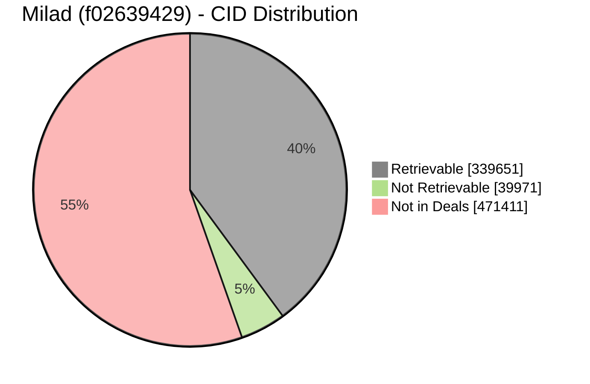
```mermaid
%%{init: {"themeVariables": {
  "pie2": "#b2df8a",
  "pie3": "#fb9a99",
  "pie1": "#838383ff"
}} }%%
pie showData
    title Milad (f02639429) - CID Distribution
    "Retrievable" : 339651
    "Not Retrievable" : 39971
    "Not in Deals" : 471411
```

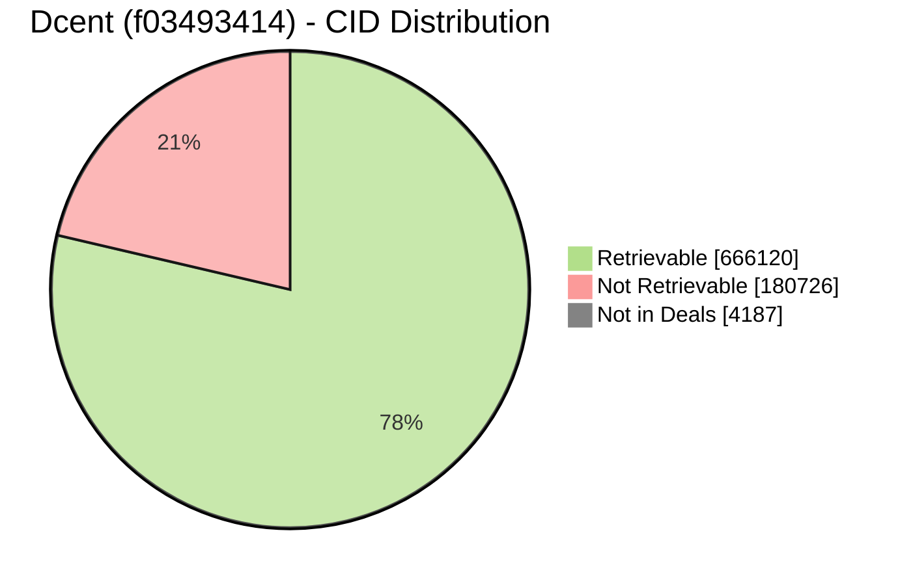
```mermaid
%%{init: {"themeVariables": {
  "pie1": "#b2df8a",
  "pie2": "#fb9a99",
  "pie3": "#838383ff"
}} }%%
pie showData
    title Dcent (f03493414) - CID Distribution
    "Retrievable" : 666120
    "Not Retrievable" : 180726
    "Not in Deals" : 4187
```

> **Insight:** Milad has 471K CIDs not in any of their deals, while Dcent only has 4K missing. This explains the overall lower coverage from Milad despite their higher success rate when they do have the data.

---

### 16. Total Files vs Unique CIDs by Preparation

In this chart, bars represent total files prepared, while the line indicates unique CIDs. A large gap suggests many files map to the same CID.

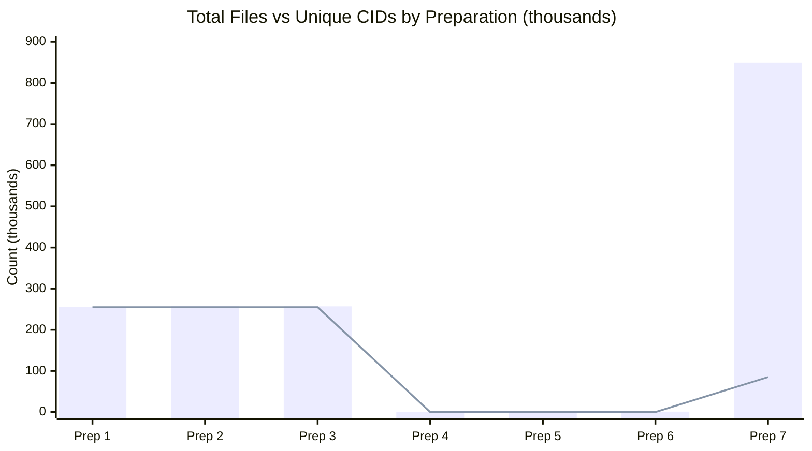
```mermaid
---
config:
    xyChart:
        width: 900
        height: 500
---
xychart-beta
    title "Total Files vs Unique CIDs by Preparation (thousands)"
    x-axis ["Prep 1", "Prep 2", "Prep 3", "Prep 4", "Prep 5", "Prep 6", "Prep 7"]
    y-axis "Count (thousands)" 0 --> 900
    bar [256, 258, 257, 0, 2, 1, 850]
    line [255, 255, 255, 0, 0, 0, 85]
```

> **Legend:** Bars = Total Files | Line = Unique CIDs
> **Note:** Prep 7 has 850K total files but only 85K unique CIDs (10:1 ratio), indicating significant file duplication or multiple versions.

---

## Prepared Content Analysis (Charts 17-20)

> **📊 Data Scope Note:**
> The following charts (17-20) use data from `prepared_content.by_preparation` in `summary_report.json`, which represents **all prepared content** including pieces that may not be part of active deals. This provides the complete view of prepared data.
>
> For metrics scoped specifically to active deals (retrieval check results), see the [Summary Report](./RETRIEVAL_SUMMARY_REPORT.md) Section 2 "Breakdown by Preparation".

### 17. Preparation Piece Details

```mermaid
---
config:
    xyChart:
        width: 900
        height: 500
    themeVariables:
        xyChart:
            plotColorPalette: "#22c55e, #ef4444, #6b7280"
---
xychart-beta
    title "Overall Piece Retrievability by Preparation"
    x-axis ["Prep 1", "Prep 2", "Prep 3", "Prep 4", "Prep 5", "Prep 6", "Prep 7"]
    y-axis "Pieces" 0 --> 6000
    bar [821, 5336, 3823, 2, 11, 2, 486]
    bar [2, 50, 1084, 2, 11, 1, 5]
    bar [2, 50, 17, 2, 11, 1, 1]
```

> **Legend:**  ⚫ Not in Active Deals | 🟢 In Active Deal and Retrievable (any provider) | 🔴 In Active Deal and  Not Retrievable (any provider)
> Prep 3 has the highest piece failure count (1,067 not retrievable).

| Preparation ID | Total Pieces | Retrievable | Not Retrievable | Not in Active Deals |
|----------------|--------:|--------:|------:|------:|
| 1              | 823 | 821 | 0 | 2 |
| 2              | 5336 | 5286 | 0 | 50 |
| 3              | 3823 | 2739 | 1067 | 17 |
| 4              | 2 | 0 | 0 | 2 |
| 5              | 11 | 0 | 0 | 11 |
| 6              | 2 | 1 | 0 | 1 |
| 7              | 486 | 481 | 4 | 1 |

---

### 18. Preparation CID Details

```mermaid
---
config:
    xyChart:
        width: 900
        height: 500
    themeVariables:
        xyChart:
            plotColorPalette: "#22c55e, #ef4444, #6b7280"
---
xychart-beta
    title "Overall CID Retrievability by Preparation (thousands)"
    x-axis ["Prep 1", "Prep 2", "Prep 3", "Prep 4", "Prep 5", "Prep 6", "Prep 7"]
    y-axis "CIDs (thousands)" 0 --> 260
    bar [255, 255, 255, 0, 0, 0.080, 85]
    bar [5, 61, 108, 0, 0, 0, 7]
    bar [0, 2, 1, 0.024, 0.391, 0, 0]
```

> **Legend:**  ⚫ Not in Active Deals | 🟢 In Active Deal and Retrievable (any provider) | 🔴 In Active Deal and  Not Retrievable (any provider)
> Prep 3 has the highest CID failure count (108,473 not retrievable).

| Preparation ID | Total Files | Unique CIDs | Retrievable | Not Retrievable | Not in Active Deals |
|----------------|------------:|------------:|------------:|----------------:|--------------------:|
| 1 | 255,764 | 255,128 | 250,523 | 4,605 | 0 |
| 2 | 258,334 | 255,169 | 191,977 | 60,968 | 2,224 |
| 3 | 256,895 | 255,214 | 145,738 | 108,473 | 1,003 |
| 4 | 62 | 25 | 1 | 0 | 24 |
| 5 | 2,318 | 392 | 1 | 0 | 391 |
| 6 | 777 | 80 | 80 | 0 | 0 |
| 7 | 850,161 | 85,029 | 78,238 | 6,791 | 0 |

---

### 19. Filesize Distribution by Preparation

This chart shows how unique CIDs are distributed across filesize buckets for each preparation.

```mermaid
---
config:
    xyChart:
        width: 900
        height: 500
    themeVariables:
        xyChart:
            plotColorPalette: "#22c55e, #3b82f6, #f59e0b, #ef4444, #6b7280"
---
xychart-beta
    title "CID Filesize Distribution by Preparation (thousands)"
    x-axis ["Prep 1", "Prep 2", "Prep 3", "Prep 7"]
    y-axis "CIDs (thousands)" 0 --> 180
    bar [170, 170, 170, 0.066]
    bar [1.2, 0.9, 0.4, 1.3]
    bar [12.6, 1.7, 2.0, 21.9]
    bar [71.2, 20.9, 28.7, 61.7]
    bar [0, 61.5, 53.9, 0]
```

> **Legend:** 🟢 0-1MB | 🔵 1-10MB | 🟠 10-100MB | 🔴 100MB-1GB | ⚫ 1GB+
> Note: Preps 4-6 omitted due to small scale. Preps 2 and 3 have significant 1GB+ files (61K and 54K respectively).

| Prep | 0-1MB | 1-10MB | 10-100MB | 100MB-1GB | 1GB+ |
|------|------:|-------:|---------:|----------:|-----:|
| 1 | 170,140 | 1,172 | 12,596 | 71,220 | 0 |
| 2 | 170,119 | 902 | 1,722 | 20,894 | 61,532 |
| 3 | 170,140 | 429 | 2,039 | 28,686 | 53,920 |
| 4 | 13 | 2 | 5 | 5 | 0 |
| 5 | 5 | 1 | 0 | 333 | 53 |
| 6 | 29 | 0 | 26 | 25 | 0 |
| 7 | 66 | 1,346 | 21,920 | 61,697 | 0 |

---

### 20. 1GB+ Files: The Retrieval Gap

This chart highlights the 1GB+ file problem - these files have 0% retrieval success across all providers.

```mermaid
---
config:
    xyChart:
        width: 900
        height: 400
    themeVariables:
        xyChart:
            plotColorPalette: "#ef4444, #6b7280"
---
xychart-beta
    title "1GB+ Files: All Failed Retrievals"
    x-axis ["Prep 2", "Prep 3", "Prep 5"]
    y-axis "CIDs (thousands)" 0 --> 70
    bar [61.5, 53.9, 0.053]
    bar [0, 0, 0]
```

> **Legend:** 🔴 1GB+ CIDs (Not Retrievable) | ⚫ Successfully Retrieved (always 0)
> **Critical:** 115,505 CIDs in the 1GB+ category have 0% retrieval success. This represents a systemic limitation.

---

## Error Analysis Charts (Charts 21-22)

> **📊 Data Scope Note:**
> The following charts (21-22) use data from `error_analysis` in `summary_report.json`, which analyzes HTTP 500 errors from CID-level retrieval checks for **active deals only**.

### 21. Error Category Mix by Preparation (Stacked Bar)

This chart shows the proportion of error types (`multihash_not_found` vs `root_load_failure`) within each preparation, revealing distinct error profiles.

```mermaid
---
config:
    xyChart:
        width: 900
        height: 500
    themeVariables:
        xyChart:
            plotColorPalette: "#f97316, #ef4444"
---
xychart-beta
    title "HTTP 500 Error Categories by Preparation"
    x-axis ["Prep 1", "Prep 2", "Prep 3", "Prep 7"]
    y-axis "Error Count (thousands)" 0 --> 120
    bar [0.009, 63.0, 108.5, 6.8]
    bar [0.864, 32.4, 0.015, 0]
```

> **Legend:** 🟠 root_load_failure | 🔴 multihash_not_found

| Preparation | Total Errors | multihash_not_found | root_load_failure | Dominant Category |
| ----------: | -----------: | ------------------: | ----------------: | ----------------- |
| 1 | 873 | 864 (99.0%) | 9 (1.0%) | multihash_not_found |
| 2 | 95,347 | 32,372 (33.9%) | 62,975 (66.1%) | root_load_failure |
| 3 | 108,475 | 15 (0.01%) | 108,460 (99.99%) | root_load_failure |
| 7 | 6,791 | 0 (0%) | 6,791 (100%) | root_load_failure |

> **Key Insights:**
> - **Prep 1** errors are almost entirely `multihash_not_found` (99%) — indicates content hash lookup failures
> - **Prep 3 & 7** are 100% `root_load_failure` — indicates IPLD node resolution failures
> - **Prep 2** shows a mix, suggesting multiple failure modes in this dataset
> - **Preps 4, 5, 6** have no HTTP 500 errors

---

### 22. Error Categories by File Type

This chart visualizes how HTTP 500 errors distribute across file types, showing h5's dominance due to large file sizes.

```mermaid
---
config:
    xyChart:
        width: 900
        height: 500
    themeVariables:
        xyChart:
            plotColorPalette: "#f97316, #ef4444"
---
xychart-beta
    title "HTTP 500 Errors by File Type and Category"
    x-axis ["h5", "png", "xml", "json"]
    y-axis "Error Count (thousands)" 0 --> 140
    bar [129.7, 24.5, 24.0, 0.001]
    bar [30.6, 1.7, 1.0, 0]
```

> **Legend:** 🟠 root_load_failure | 🔴 multihash_not_found

| File Type | Total Errors | multihash_not_found | root_load_failure | % of All Errors |
| --------- | -----------: | ------------------: | ----------------: | --------------: |
| h5 | 160,210 | 30,555 | 129,655 | **75.8%** |
| png | 26,245 | 1,714 | 24,531 | 12.4% |
| xml | 25,030 | 982 | 24,048 | 11.8% |
| json | 1 | 0 | 1 | 0.0% |

> **Key Insight:** h5 (HDF5) files account for **75.8%** of all HTTP 500 errors (160,210 of 211,486 total). This correlates directly with their large file sizes — the majority of h5 files in Preps 2 and 3 are 1GB+, which have 0% retrieval success.
