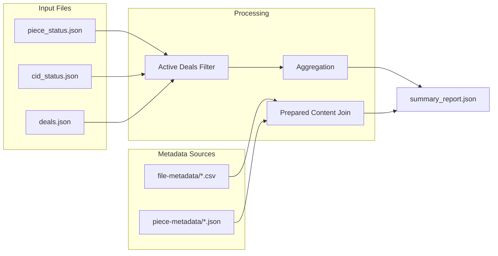

# Data Sources

> **Purpose:** Documents the input files consumed by the summary report pipeline and their schemas.

---

## Overview

The summary report pipeline consumes three primary data sources:

```text
┌─────────────────────────────────────────────────────────────┐
│                      INPUT FILES                            │
├─────────────────────────────────────────────────────────────┤
│  1. final_retrieval_piece_status_postprocessed.json         │
│  2. final_retrieval_cid_status_postprocessed.json           │
│  3. deals.json                                              │
├─────────────────────────────────────────────────────────────┤
│                   METADATA SOURCES                          │
├─────────────────────────────────────────────────────────────┤
│  4. File-metadata CSVs (output/file-metadata/*.csv)         │
│  5. Piece-metadata JSONs (output/piece-metadata/*.json)     │
└─────────────────────────────────────────────────────────────┘
```

---

## 1. Piece-Level Retrieval Status

**File:** `output/retrieval-status/final_retrieval_piece_status_postprocessed.json`

Post-processed piece-level retrieval results. Each record represents a piece CID and its retrieval status across storage providers.

### Schema

| Field | Type | Description |
|-------|------|-------------|
| `pieceCid` | string | Unique piece content identifier |
| `filesize_predeal` | integer | File size in bytes before deal |
| `preparation` | integer/string | Preparation ID (e.g., 1, 2, "prep1") |
| `storage_providers` | string[] | List of provider IDs (e.g., `["f02639429", "f03493414"]`) |
| `has_active_deal` | boolean | Whether piece has any active deal |
| `active_deal_providers` | string[] | Providers with active deals for this piece |
| `storage_provider_retrieval_check` | object | Retrieval check results keyed by provider ID |

### Retrieval Check Object

The `storage_provider_retrieval_check` object is keyed by provider ID. Each value contains:

| Field | Type | Description |
|-------|------|-------------|
| `provider_name` | string | Human-readable provider name |
| `provider_id` | string | Provider ID (e.g., "f02639429") |
| `retrieval_type` | string | Always "piece" for this file |
| `url` | string | Retrieval endpoint URL |
| `timestamp` | string | ISO 8601 timestamp of check |
| `status` | string | "available", "unavailable", or "error" |
| `status_code` | integer | HTTP status code (200, 404, 500, etc.) |
| `content_length` | integer/null | Response content length in bytes |
| `error_message` | string/null | Error message if status != "available" |
| `response_body` | string/null | Response body (if applicable) |
| `response_time_ms` | integer | Response time in milliseconds |
| `deal_state` | string | "active", "expired", etc. |
| `deal_id` | string | Deal identifier |

---

## 2. CID-Level Retrieval Status

**File:** `output/retrieval-status/final_retrieval_cid_status_postprocessed.json`

Post-processed CID-level retrieval results. Each record represents an individual file CID.

### CID Status Schema

| Field | Type | Description |
|-------|------|-------------|
| `cid` | string | File content identifier |
| `pieceCid` | string | Parent piece CID |
| `preparation` | integer/string | Preparation ID |
| `file_name` | string | Original filename |
| `file_type` | string | File extension (e.g., "json", "h5", "png") |
| `file_size` | integer | File size in bytes |
| `provider_id` | string | Provider ID for this record |
| `storage_providers` | string[] | List of provider IDs |
| `has_active_deal` | boolean | Whether CID has any active deal |
| `active_deal_providers` | string[] | Providers with active deals |
| `storage_provider_retrieval_check` | object | Retrieval check results (same structure as piece-level, but `retrieval_type` = "cid") |

---

## 3. Deals Database

**File:** `output/deals.json`

Authoritative source for deal state. Used to confirm which (pieceCID, providerid) combinations are active.

### Deals Schema

| Field | Type | Description |
|-------|------|-------------|
| `pieceCid` | string | Piece content identifier |
| `provider` | string | Storage provider ID |
| `state` | string | Deal state: "active", "expired", etc. |
| `dealId` | integer | On-chain deal identifier |
| `pieceSize` | integer | Piece size in bytes |
| `startEpoch` | integer | Deal start epoch |
| `endEpoch` | integer | Deal end epoch |
| `verified` | boolean | Whether deal is verified |

> **Note:** Additional fields exist (`id`, `createdAt`, `updatedAt`, `proposalId`, `label`, etc.) but are not used by the summary pipeline.

### Usage

Build a set of active deal tuples:

```python
active_deals = {
    (record["pieceCid"], record["provider"])
    for record in deals
    if record["state"] == "active"
}
```

A retrieval check is "in active deals" only if `(pieceCid, provider)` in `active_deals`.

---

## 4. File-Metadata CSVs

**Directory:** `output/file-metadata/`

Source files for the `prepared_content` section. Each CSV represents a preparation's file inventory.

### Filename Pattern

```text
<dataset>_prep<N>_details.csv
```

Examples:

- `GEDI02_B_prep1_details.csv`
- `GEDI_L4A_AGB_Density_V2_1_2056_prep7_details.csv`

### CSV Columns

| Column | Description |
|--------|-------------|
| `id` | Record identifier |
| `cid` | File content identifier |
| `path` | Original file path |
| `hash` | File hash |
| `size` | File size in bytes |
| `lastModifiedNano` | Last modification timestamp (nanoseconds) |
| `attachmentId` | Attachment identifier |
| `directoryId` | Directory identifier |
| `fileName` | File name with extension |
| `rootCid` | Root CID |
| `pieceCid` | Parent piece CID |

### Preparation ID Extraction

Extract preparation ID from filename:

```python
# "GEDI02_B_prep1_details.csv" → "1"
match = re.search(r'prep(\d+)', filename)
prep_id = match.group(1) if match else None
```

---

## 5. Piece-Metadata JSONs

**Directory:** `output/piece-metadata/`

Source files for piece-level prepared content. Each JSON represents a preparation's piece inventory.

### Piece-Metadata Filename Pattern

```text
<dataset>_prep<N>_details.json
```

### JSON Structure

```json
[
  {
    "attachmentId": 1,
    "storageId": 1,
    "source": {
      "id": 1,
      "name": "GEDI02_B",
      "type": "http",
      "path": "earthdata/GEDI02_B"
    },
    "pieces": [
      {
        "pieceCid": "baga6ea4seaq...",
        "pieceSize": 34359738368,
        "fileSize": 32212254720,
        "numOfFiles": 156,
        "rootCid": "bafkrei...",
        "preparationId": 1
      }
    ]
  }
]
```

### Fields

| Field | Description |
|-------|-------------|
| `attachmentId` | Attachment identifier |
| `storageId` | Storage identifier |
| `source.name` | Dataset name |
| `pieces[].pieceCid` | Piece content identifier |
| `pieces[].pieceSize` | Piece size (padded) in bytes |
| `pieces[].fileSize` | Actual file size in bytes |
| `pieces[].numOfFiles` | Number of files in piece |
| `pieces[].rootCid` | Root CID of the piece |
| `pieces[].preparationId` | Preparation identifier |

> **Note:** Additional fields exist (`pieces[].id`, `pieces[].createdAt`, `pieces[].jobId`, etc.) but are not used by the summary pipeline.

---

## Data Flow



---

## Key Concepts

### Active Deal Verification

The pipeline **does not trust** the `hasactivedeal` field in retrieval status files. Instead, it cross-references with `deals.json`:

1. Load `deals.json` and build active deal set
2. For each retrieval record, check if `(pieceCid, providerid)` is in active set
3. Only include in primary metrics if verified as active

### Provider-Level Analysis

Each piece may have deals with multiple providers. The pipeline:

1. Treats each (pieceCid, providerid) combination separately
2. Computes per-provider metrics independently
3. Aggregates for overall statistics

### CID Deduplication

The same CID may appear multiple times in file-metadata CSVs (same file with different paths). The pipeline uses **"FIRST ONE IN"** strategy:

- First occurrence's filetype and size are used
- Subsequent duplicates are counted but not re-classified
