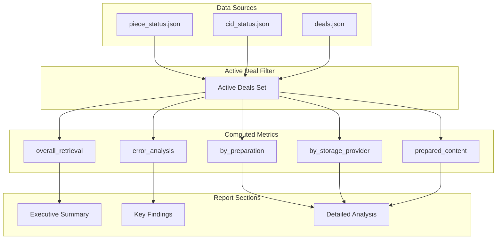
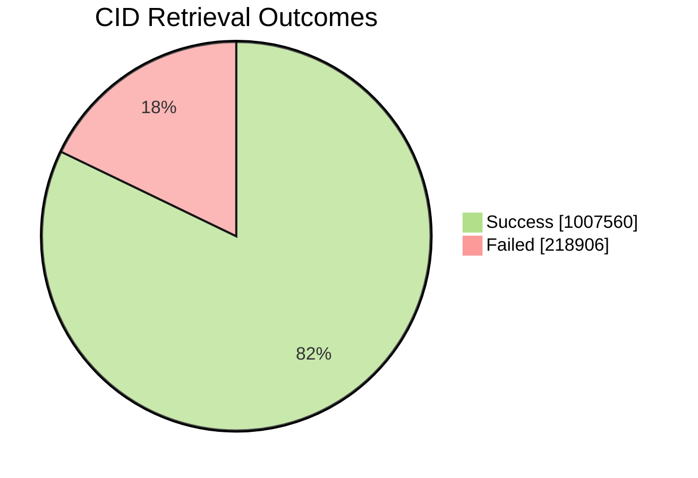
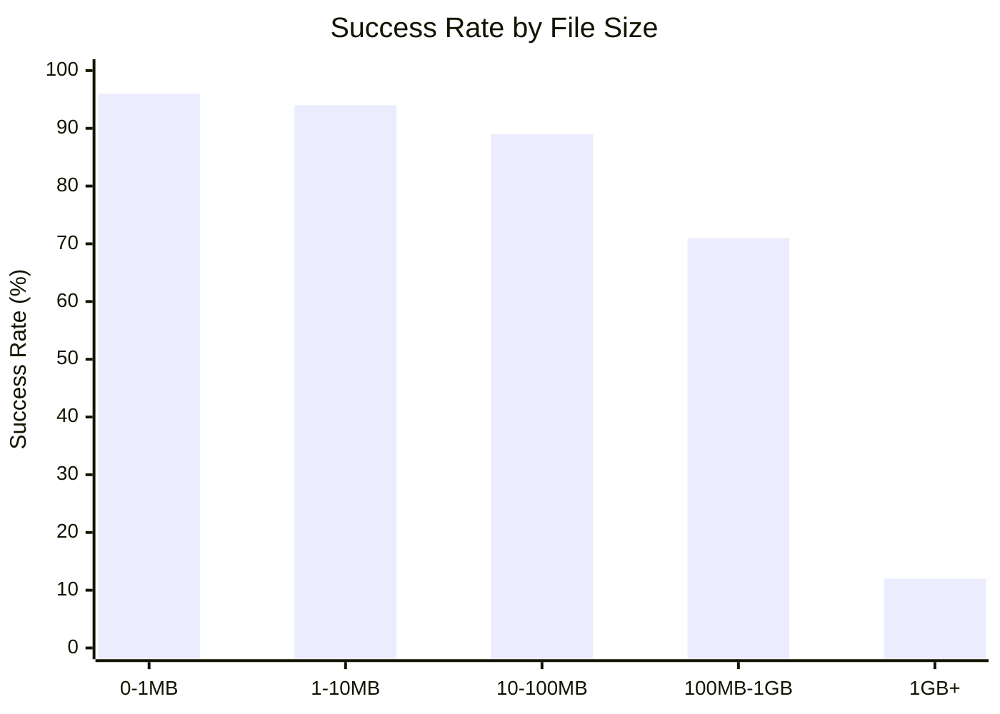

# Narrative Generation Guide

> **Purpose:** Primary guide for LLMs generating human-readable reports from `summary_report.json`.
>
> **Audience:** LLMs tasked with converting JSON metrics into narrative prose for stakeholders.

---

## Quick Start for LLMs

When generating a narrative report from `summary_report.json`:

1. **Read the JSON** and identify key metrics
2. **Apply interpretation thresholds** (see below) to determine tone
3. **Use the templates** to structure each section
4. **Include specific numbers** with context
5. **Highlight anomalies** (e.g., 1GB+ failure cliff, cross-provider failures)

---

## Interpretation Thresholds

Use these thresholds to determine narrative tone and emphasis:

### Success Rate Interpretation

| Rate | Classification | Narrative Tone |
|------|----------------|----------------|
| ≥ 95% | Excellent | "Strong performance", "highly reliable" |
| 80-94% | Good | "Generally successful", "room for improvement" |
| 60-79% | Concerning | "Significant issues", "requires attention" |
| < 60% | Critical | "Severe problems", "immediate action needed" |

### All-Providers-Failed Interpretation

| Percentage | Classification | Narrative Tone |
|------------|----------------|----------------|
| < 1% | Negligible | "Minimal impact", "isolated cases" |
| 1-5% | Minor | "Some content unreachable", "localized issues" |
| 5-15% | Significant | "Notable data gaps", "investigation needed" |
| > 15% | Severe | "Widespread failure", "critical data loss risk" |

### File Size Correlation

| 1GB+ Success Rate | Interpretation |
|-------------------|----------------|
| ≥ 80% | Large files handled well |
| 50-79% | Large file issues present |
| 20-49% | Significant large file problems |
| < 20% | **"1GB+ cliff"** - highlight prominently |

---

## Metric Relationships

Understanding how metrics relate helps generate coherent narratives:



### Key Relationships

1. **overall_retrieval** ← Aggregated from per-provider checks
2. **by_preparation** ← Same data, grouped by prep ID
3. **by_storage_provider** ← Same data, grouped by provider
4. **prepared_content** ← Different scope (all prepared, not just active deals)
5. **error_analysis** ← Subset focusing on HTTP 500 errors

---

## Report Section Templates

### Executive Summary Template

```markdown
## Executive Summary

This report analyzes retrieval performance for [DATASET_NAME] data stored across [N] storage providers on Filecoin.

### Key Metrics at a Glance

| Metric | Value | Assessment |
|--------|-------|------------|
| Unique Pieces in Active Deals | [counts.total_unique_pieces_in_active_deals] | — |
| Unique CIDs in Active Deals | [counts.total_unique_cids_in_active_deals] | — |
| Piece Retrieval Success Rate | [piece_outcomes.success_rate × 100]% | [EXCELLENT/GOOD/CONCERNING/CRITICAL] |
| CID Retrieval Success Rate | [cid_outcomes.success_rate × 100]% | [EXCELLENT/GOOD/CONCERNING/CRITICAL] |
| CIDs Retrievable by All Providers | [unique_metrics.cids.all_providers_success] ([%]) | — |
| CIDs with All Providers Failed | [unique_metrics.cids.all_providers_failed] ([%]) | [ASSESSMENT] |

### Headlines

1. **[MOST_SIGNIFICANT_FINDING]** - [one sentence explanation]
2. **[SECOND_FINDING]** - [one sentence explanation]
3. **[THIRD_FINDING]** - [one sentence explanation]
```

### Per-Provider Analysis Template

```markdown
## Provider: [providername] ([providerid])

### Performance Summary

- **Pieces in Active Deals:** [pieces_in_active_deals]
- **Piece Success Rate:** [piece_metrics.success_rate × 100]% ([success_count]/[total])
- **CID Success Rate:** [cid_metrics.success_rate × 100]% ([success_count]/[total])

### Assessment

[INTERPRETATION based on thresholds]

[If success_rate < 80%]:
> ⚠️ This provider shows concerning performance. Investigation recommended.

[If success_rate >= 95%]:
> ✅ This provider demonstrates excellent retrieval reliability.
```

### Error Analysis Template

```markdown
## Error Analysis

### Overview

- **Total HTTP 500 Errors:** [overview.total_500_errors]
- **CIDs Affected:** [overview.cids_with_any_500_error] ([overview.percentage_of_active_deal_cids]% of active deal CIDs)
- **CIDs Where All Providers Failed:** [overview.cids_all_providers_failed]

### Error Categories

[List top categories by count]

1. **[category_name]**: [count] errors ([percentage]%)
   - [Brief explanation of what this error means]

### Cross-Provider Failure Analysis

Of [cross_provider_analysis.cids_with_multiple_providers] CIDs with deals on multiple providers:
- **All Providers Failed:** [all_providers_fail] ([%]) — Indicates systemic issues
- **Some Providers Failed:** [some_providers_fail] ([%]) — Provider-specific problems

[If all_providers_fail is significant]:
> 🔴 The high rate of shared failures suggests issues with the source data or sealing process rather than provider-specific problems.
```

---

## Example JSON-to-Prose Translations

### Example 1: Overall Success Rate

**JSON Input:**

```json
{
  "overall_retrieval": {
    "piece_outcomes": {
      "success_count": 16842,
      "failure_count": 4158,
      "success_rate": 0.802
    }
  }
}
```

**Generated Prose:**

> Piece-level retrievals achieved an **80.2% success rate** (16,842 successful out of 21,000 total checks). This falls in the "Good" range but indicates room for improvement, particularly for the 4,158 failed retrieval attempts.

### Example 2: File Size Correlation

**JSON Input:**

```json
{
  "overall_retrieval": {
    "by_filesize_bucket": {
      "0-1MB": { "success_rate": 0.96 },
      "1-10MB": { "success_rate": 0.94 },
      "10-100MB": { "success_rate": 0.89 },
      "100MB-1GB": { "success_rate": 0.71 },
      "1GB+": { "success_rate": 0.12 }
    }
  }
}
```

**Generated Prose:**

> A stark **"1GB+ cliff"** is evident in the data: files under 1MB achieve a 96% success rate, but this drops dramatically to just **12% for files over 1GB**. This pattern strongly suggests that large file handling is a critical infrastructure issue requiring immediate attention.

### Example 3: Cross-Provider Analysis

**JSON Input:**

```json
{
  "error_analysis": {
    "cross_provider_analysis": {
      "cids_with_multiple_providers": 45000,
      "all_providers_fail": 3200,
      "some_providers_fail": 2300
    }
  }
}
```

**Generated Prose:**

> Of the 45,000 CIDs with deals on multiple storage providers, **3,200 (7.1%) failed retrieval from all providers**. This shared failure rate is concerning—if failures were purely provider-specific, we'd expect minimal overlap. The data suggests underlying issues with the source files or sealing process.
>
> An additional 2,300 CIDs (5.1%) failed on some but not all providers, indicating provider-specific issues that warrant individual investigation.

---

## Required Elements in Every Report

### Must Include

1. **Dataset context** - What data is being analyzed
2. **Scope clarification** - "Active deals only" vs "all prepared content"
3. **Absolute numbers AND percentages** - Always provide both
4. **Threshold-based assessments** - Use consistent terminology
5. **Actionable observations** - Not just facts, but implications

### Must Avoid

1. ❌ Stating rates without context (e.g., "80% success" without comparison)
2. ❌ Confusing "retrievable by all providers" semantics (see [07-caveats-and-pitfalls.md](07-caveats-and-pitfalls.md))
3. ❌ Mixing active-deal and prepared-content scopes without clarification
4. ❌ Ignoring the 1GB+ cliff if present in data
5. ❌ Presenting cross-provider failures without interpretation

---

## Visualization Guidelines

### When to Embed Charts

| Chart Type | Embed When | Purpose |
|------------|------------|---------|
| Pie Chart (outcomes) | Always | Quick success/failure visual |
| Bar Chart (by filesize) | 1GB+ cliff present | Highlight size correlation |
| Bar Chart (by provider) | Provider variance > 10% | Compare provider performance |
| Pie Chart (error categories) | > 1000 errors | Show error distribution |

### Mermaid Syntax Reference

#### **Pie Chart:**



> Note: To set specific colors for pie chart sections, use the `init` directive in the mermaid syntax.
>
> Syntax in use:

```text
  %%{init: {"themeVariables": {
    "pie1": "#b2df8a",
    "pie2": "#fb9a99"
  }} }%%
  ... mermaid pie chart code ...
```
>

#### **Bar Chart (XY):**



#### Stacked Bar Charts

Mermaid's `xychart-beta` doesn't have native stacked bars, but you can simulate them by layering multiple `bar` statements. Each bar series stacks **additively from the bottom**.

**Key principles:**

1. **Color palette order = stack order (bottom to top):** The first color in `plotColorPalette` applies to the first `bar` statement (bottom of stack), second color to second `bar`, etc.

2. **Values are cumulative heights, not increments:** Each `bar` array represents the **total height up to that segment**, not the segment size. If a category has 0 items, its bar value equals the previous segment's value.

#### Stacked Bar Example: Piece Retrievability

Given this data:

| Prep | Not in Deals | Retrievable | Not Retrievable | Total |
|------|-------------:|------------:|----------------:|------:|
| 1    | 2            | 821         | 0               | 823   |
| 3    | 17           | 2,739       | 1,067           | 3,823 |

To create a stacked bar where total height = Total Pieces:

```mermaid
---
config:
    themeVariables:
        xyChart:
            plotColorPalette: "#ef4444, #22c55e, #6b7280,"
---
xychart-beta
    title "Piece Retrievability by Preparation"
    x-axis ["Prep 1", "Prep 3"]
    y-axis "Pieces" 0 --> 4000
    bar [823, 3823]
    bar [823, 2756]
    bar [2, 17]
```



**How values are calculated:**

| Stack Layer | Color | Prep 1 Value | Prep 3 Value | Calculation |
|-------------|-------|-------------:|-------------:|-------------|
| 1 (bottom)  | Gray  | 2            | 17           | Not in Deals |
| 2 (middle)  | Green | 823          | 2,756        | Not in Deals + Retrievable |
| 3 (top)     | Red   | 823          | 3,823        | Not in Deals + Retrievable + Not Retrievable |

> **Note:** Prep 1's "Not Retrievable" = 0, so layers 2 and 3 have the same value (823). The red segment has zero height, which is correct.

---

## Tone and Style

### Voice

- **Professional but accessible** - Avoid jargon without explanation
- **Data-driven** - Every claim backed by specific numbers
- **Actionable** - Suggest implications and next steps
- **Balanced** - Acknowledge both successes and issues

### Emphasis Hierarchy

1. 🔴 **Critical issues** - Call out prominently (e.g., > 15% all-providers-failed)
2. 🟡 **Notable patterns** - Highlight for investigation (e.g., 1GB+ cliff)
3. 🟢 **Positive findings** - Acknowledge good performance
4. ℹ️ **Contextual notes** - Explain scope or methodology

### Example Emphasis

> 🔴 **Critical:** 18% of CIDs (8,234 files) are unretrievable from any storage provider with an active deal. This represents potential data loss.
>
> 🟡 **Notable:** The "1GB+ cliff" shows large file success dropping from 89% to 12%. This pattern is consistent across both providers.
>
> 🟢 **Positive:** Preparations 1-3 show > 90% success rates, demonstrating reliable storage for those datasets.

---

## Checklist Before Completing Report

- [ ] Executive summary includes all key metrics with assessments
- [ ] Success rates use threshold terminology consistently
- [ ] "Retrievable by all providers" includes clarifying footnote
- [ ] Scope differences between sections are explained
- [ ] All percentages have corresponding absolute numbers
- [ ] 1GB+ performance is highlighted if concerning
- [ ] Cross-provider analysis interprets "both fail" implications
- [ ] Error categories are explained, not just listed
- [ ] At least 3 actionable recommendations provided
