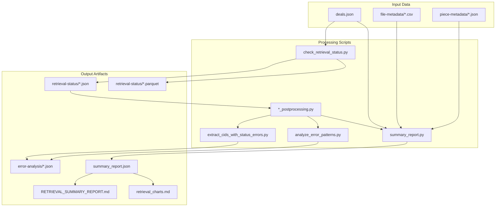

# Output Artifacts

> **Purpose:** Documents the files produced by the summary report pipeline, their locations, and relationships.

---

## Output Directory Structure

```text
output/
├── summary-reports/
│   ├── summary_report.json          # Machine-readable metrics
│   ├── RETRIEVAL_SUMMARY_REPORT.md  # Human-readable narrative
│   └── retrieval_charts.md          # Visualization gallery
├── retrieval-status/
│   ├── final_retrieval_piece_status.json
│   ├── final_retrieval_piece_status.parquet
│   ├── final_retrieval_piece_status_postprocessed.json
│   ├── final_retrieval_cid_status.json
│   ├── final_retrieval_cid_status.parquet
│   ├── final_retrieval_cid_status_postprocessed.json
│   ├── cid_all_providers_failed.json
│   ├── cid_status_errors_extracted.json
│   ├── retrieval_summary.json
│   ├── checkpoint.parquet           # Processing checkpoint
│   └── checkpoint.backup_*.parquet  # Checkpoint backups
├── error-analysis/
│   ├── cid_errors_summary.json
│   ├── cid_status_errors.json
│   ├── cid_all_providers_failed.json
│   └── error_patterns_analysis.json
├── file-metadata/
│   └── *.csv                        # Per-preparation file inventories
├── piece-metadata/
│   └── *.json                       # Per-preparation piece inventories
├── logs/                            # Processing logs
└── deals.json                       # Authoritative deal state
```

---

## Primary Artifacts

### 1. summary_report.json

**Location:** `output/summary-reports/summary_report.json`

**Purpose:** Machine-readable JSON containing all computed metrics.

**Consumers:**

- Human-readable report generation (LLM or templates)
- Dashboards and monitoring systems
- Automated alerting pipelines
- Downstream analysis tools

**Schema:** See [02-json-schema.md](02-json-schema.md) for complete structure.

**Generation:** Produced by `scripts/summary_report.py`

**Example usage:**

```bash
python scripts/summary_report.py \
  --piece-status output/retrieval-status/final_retrieval_piece_status_postprocessed.json \
  --cid-status output/retrieval-status/final_retrieval_cid_status_postprocessed.json \
  --deals output/deals.json \
  --out output/summary-reports/summary_report.json
```

---

### 2. RETRIEVAL_SUMMARY_REPORT.md

**Location:** `output/summary-reports/RETRIEVAL_SUMMARY_REPORT.md`

**Purpose:** Primary narrative report for human consumption.

**Audience:** Stakeholders, data stewards, operators

**Structure:**

1. Header & Metadata
2. Executive Summary (with embedded pie charts)
3. Key Findings
4. Table of Contents
5. Overall Retrieval
6. Analysis by Dimension (filetype, filesize, preparation, provider)
7. Detailed Breakdown by Preparation
8. Detailed Breakdown by Provider
9. Prepared Content Analysis
10. Retrieval Error Analysis
11. Appendix

**Generation:** Can be produced by:

- LLM using `summary_report.json` + [04-narrative-generation.md](04-narrative-generation.md)
- Template-based rendering (not currently implemented)

---

### 3. retrieval_charts.md

**Location:** `output/summary-reports/retrieval_charts.md`

**Purpose:** Complete gallery of all Mermaid visualizations.

**Relationship to main report:**

- Contains all 22+ charts
- Some charts are embedded in `RETRIEVAL_SUMMARY_REPORT.md`
- Others are available for deep-dive analysis

**Chart categories:**

| Category | Chart Numbers | Description |
|----------|---------------|-------------|
| Core Metrics | 1-5 | Pie charts, success rates |
| Preparation Analysis | 6, 10 | Per-prep comparisons |
| Provider Comparison | 7-9 | Provider performance |
| Distribution Analysis | 11-12 | Filesize, filetype |
| Provider Coverage | 13-16 | Deal distribution |
| Prepared Content | 17-20 | Prepared vs retrievable |
| Error Analysis | 21-22 | Error patterns |

**Generation:** Can be produced alongside `RETRIEVAL_SUMMARY_REPORT.md` using the same process.

- LLM using `summary_report.json` + [04-narrative-generation.md](04-narrative-generation.md)
- Guidelines for generating visualizations found in [04-narrative-generation.md](04-narrative-generation.md#visualization-guidelines)

---

## Supporting Artifacts

### error-analysis/

Error analysis intermediate files:

| File | Description |
|------|-------------|
| `cid_errors_summary.json` | Aggregated error statistics |
| `cid_status_errors.json` | Raw error records |
| `cid_all_providers_failed.json` | CIDs failing all providers |
| `error_patterns_analysis.json` | Normalized error patterns |

**Produced by:** `scripts/analyze_error_patterns.py`

### retrieval-status/

Retrieval check results at various processing stages:

| File | Description |
|------|-------------|
| `final_retrieval_piece_status.json` | Raw piece-level results |
| `final_retrieval_piece_status.parquet` | Parquet format of piece results |
| `final_retrieval_piece_status_postprocessed.json` | Post-processed piece results |
| `final_retrieval_cid_status.json` | Raw CID-level results |
| `final_retrieval_cid_status.parquet` | Parquet format of CID results |
| `final_retrieval_cid_status_postprocessed.json` | Post-processed CID results |
| `cid_all_providers_failed.json` | CIDs where all providers failed |
| `cid_status_errors_extracted.json` | Extracted error status records |
| `retrieval_summary.json` | Quick summary statistics |
| `checkpoint.parquet` | Processing checkpoint for resumable runs |

**Produced by:**

- `scripts/check_retrieval_status.py`
- `scripts/check_retrieval_status-piece_postprocessing.py`
- `scripts/check_retrieval_status-cid_postprocessing.py`
- `scripts/extract_cids_with_status_errors.py`

---

## Artifact Dependencies



---

## File Format Specifications

### JSON Files

- **Encoding:** UTF-8
- **Formatting:** Pretty-printed with 2-space indentation
- **Null handling:** Explicit `null` for missing values (not omitted keys)

### Markdown Files

- **Encoding:** UTF-8
- **Line endings:** LF (Unix-style)
- **Max line length:** No hard limit; natural paragraph breaks
- **Chart syntax:** Mermaid (fenced code blocks with `mermaid` language)

### CSV Files

- **Encoding:** UTF-8
- **Delimiter:** Comma
- **Quoting:** Double quotes for fields containing commas
- **Header:** First row

---

## Regeneration Commands

### Full Pipeline

```bash
# 1. Fetch latest deal data
python scripts/fetch_deals.py

# 2. Run retrieval checks (takes time)
python scripts/check_retrieval_status.py

# 3. Post-process results
python scripts/check_retrieval_status-piece_postprocessing.py
python scripts/check_retrieval_status-cid_postprocessing.py

# 4. Extract error statuses
python scripts/extract_cids_with_status_errors.py

# 5. Analyze errors
python scripts/analyze_error_patterns.py

# 6. Generate summary report
python scripts/summary_report.py \
  --piece-status output/retrieval-status/final_retrieval_piece_status_postprocessed.json \
  --cid-status output/retrieval-status/final_retrieval_cid_status_postprocessed.json \
  --deals output/deals.json \
  --out output/summary-reports/summary_report.json
```

### Report Only (from existing summary_report.json)

The narrative report can be regenerated without re-running the full pipeline by using an LLM with `summary_report.json` as input.

---

## Versioning

Output files are not versioned by default. For historical tracking:

1. Copy `output/summary-reports/` to dated directory before regeneration
2. Use git to track changes to output files
3. Consider timestamping filenames for critical snapshots
